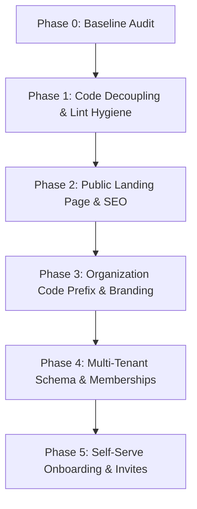

# AI NEX OS — Agency-Agnostic Multi-Tenant SaaS Rearchitecture
## Phase 0: Read-Only Baseline Audit & Gap Analysis

**Document Path:** `docs/audit/AGENCY_SAAS_REARCHITECTURE_BASELINE.md`  
**Date:** September 25, 2026  
**Auditor:** Antigravity AI Engineering Assistant  
**Target Repository:** `ai-nexos` (`NEXOS Comb / AIC NEXOS / ai-nexos`)  
**Target Branch:** `phase-2-production-readiness`  
**Production Host:** `https://ai-nexos.antideploy.com`  
**Current Product State:** Next.js 16.3.0 · React 19.2.4 · Supabase Auth · Drizzle ORM · PostgreSQL  
**Audit Scope:** Read-Only Baseline, Non-Mutating, Non-Destructive  

---

## 1. Executive Summary

This audit establishes the definitive technical and architectural baseline for transitioning **AI NEX OS** from an internal, organization-specific creative agency operating system (tailored to "AI Collective") into a world-class, agency-agnostic, multi-tenant B2B SaaS operating system for creative and production agencies worldwide.

### Key Audit Findings:
1. **Strong Engineering Foundations**: The repository features clean Next.js 16 App Router architecture, a comprehensive schema across 50+ relational tables in PostgreSQL managed via Drizzle ORM, strict runtime and build-time environment variable validation, 725 passing unit tests across 51 test suites, zero TypeScript typecheck errors, and an AST-based static safety gate (`tenant-identity-surface.test.ts`) preventing caller-supplied tenant IDs in Server Actions.
2. **AI Collective Single-Tenant Coupling**: The codebase contains hardcoded prefixes (`AIC-YYYY-XXXX` for projects, `AIC-T-YYYY-XXXX` for tasks, `AIC-0001` for employees), seed assumptions in `.env.example` (`SEED_ORG_NAME="AI Collective"`), historical domain documentation references (`app.aicollective.agency`), and an architectural philosophy rooted in "One Organization".
3. **Tenancy Constraints**: While every operational database table references `organization_id`, the `users` table directly carries a mandatory `organization_id NOT NULL` and a global unique constraint on `email` (`uq_users_email`). A user account can belong to only one organization; there is no `memberships` table, no organization switcher, and no mechanism for an individual to collaborate across multiple agencies.
4. **Missing Self-Service & Onboarding Flows**: There is currently no public signup, self-serve agency registration, invitation acceptance mechanism, or onboarding wizard. Unprovisioned users are bounced to `/unprovisioned`. The employee repository explicitly throws an error on creation (`realEmployeeAdminRepository.create()`).
5. **No Public Marketing Surface**: The root route `/` performs an immediate redirect (`/dashboard` if authenticated, `/login` if unauthenticated). There is no marketing landing page, no public feature showcase, no pricing breakdown, and no public SEO infrastructure (`robots.txt`, `sitemap.xml`, or Open Graph social images).
6. **Zero Mutation Compliance**: This audit was completed entirely in read-only mode. No production data, database tables, Supabase configurations, or deployment environments were altered.

---

## 2. Current Architecture

### 2.1 Technology Stack & Runtime
- **Framework**: Next.js `16.3.0` (Canary / App Router) running on Node.js 20+ runtime.
- **UI & Styling**: React `19.2.4`, Tailwind CSS `v4` (`@import "tailwindcss"; @import "shadcn/tailwind.css";`), `@base-ui/react`, Radix UI primitives, Lucide React icons, and Framer Motion.
- **Database & ORM**: PostgreSQL (hosted on Supabase) accessed via Drizzle ORM `0.45.2` and `postgres.js` `3.4.9`.
- **Authentication**: Supabase Auth via `@supabase/ssr` `0.12.0` and `@supabase/supabase-js` `2.110.2`.
- **Edge Routing & Proxy**: Next.js 16 file convention `src/proxy.ts` (successor to `middleware.ts`), enforcing dual-domain routing, per-request CSP nonces, session refreshment, and route protection.
- **Cache & State**: In-memory and Redis-backed portal caches, Zustand for client state, React Query (`@tanstack/react-query` `v5`).

### 2.2 Dual-Domain Architecture
The platform implements a domain-splitting architecture in `src/proxy.ts`:
- **App Domain** (`NEXT_PUBLIC_APP_DOMAIN`, e.g., `app.example.com` or `localhost:3000`): Internal authenticated agency workforce dashboard. Unauthenticated visitors are routed to `/login`.
- **Portal Domain** (`NEXT_PUBLIC_PORTAL_DOMAIN`, e.g., `portal.example.com` or `portal.localhost:3000`): External client-facing portal. Rewritten internally to `/portal/*`. External access is governed entirely by unauthenticated cryptographically signed share tokens (`/s/{token}`) requiring no user account.

### 2.3 Layered Data Access Model
The application uses two distinct database communication channels:
1. **Supabase Client (`createClient()` in `@/lib/supabase/server`)**: Uses the anon key with the user's session JWT. All queries execute under PostgreSQL Row Level Security (RLS). Used primarily by `getCurrentUser()` in `src/features/auth/current-user.ts`.
2. **Drizzle ORM Client (`db` in `@/db`)**: Connects over the PgBouncer transaction pooler (`DATABASE_URL`, `prepare: false`) as the `postgres` administrative role. **This connection bypasses RLS**. Consequently, multi-tenant isolation for all Server Actions in workspace modules rests entirely on application-level filtering: `eq(table.organizationId, user.organizationId)`.

---

## 3. Product Context Findings

### 3.1 Historical Context from Specification Documents
Analysis of the founding documentation in `DOCS/` (`AIC NexOS (PRD).md`, `AIC Nex OS (SDS).md`, `AIC Nex OS (DBD).md`, `AIC Nex OS (TRD) .md`):
- **Original Client & Sponsor**: Designed specifically for "AI Collective (AIC)" as an internal creative agency management platform.
- **Architectural Axiom**: The core philosophy outlined in SDS §2 states:
  ```
  One Organization
       ↓
  Multiple Clients
       ↓
  Multiple Projects
       ↓
  Multiple Departments
       ↓
  Multiple Deliverables
       ↓
  One Unified System
  ```
- **Strategic SaaS Pivot Foreshadowed**: PRD §1 already stated the long-term ambition: *"The long-term vision is to evolve AIC Nexus OS into a scalable, multi-tenant SaaS platform for creative agencies worldwide."*
- **Positioning Evolution**: 
  - *Old*: AIC Nex OS — The Operating System for Creative Execution (built exclusively for AI Collective).
  - *New*: **AI NEX OS** — The Agency Operating System. The Operating System for Creative Execution (Multi-tenant B2B SaaS for creative agencies).

---

## 4. AI Collective Coupling Inventory

The table below catalogs every hardcoded reference, identifier, and assumption tied to "AI Collective" across the repository:

| Category | File Path | Code / Occurrence | Severity / Impact |
| :--- | :--- | :--- | :--- |
| **Code Generation** | `src/features/projects/real-actions.ts` (L40-69) | `generateProjectCode`: hardcodes prefix ``AIC-${currentYear}-${nextSequence}`` | High: All project IDs in all agencies start with `AIC-` |
| **Code Generation** | `src/features/tasks/real-actions.ts` (L42-68) | `generateTaskCode`: hardcodes prefix ``AIC-T-${currentYear}-${nextSequence}`` | High: All task IDs in all agencies start with `AIC-T-` |
| **Code Generation** | `src/features/meetings/real-actions.ts` (L217) | `promoteActionItemToTask`: hardcodes prefix ``AIC-T-${year}-${random}`` | High: Meeting action item conversion hardcodes `AIC-T-` |
| **Schema Comment** | `src/db/schema/tasks.ts` (L33) | `taskCode: text("task_code").notNull().unique(), // AIC-T-YYYY-XXXX` | Low: Schema documentation only |
| **Workforce Types** | `src/features/workforce/employees/types.ts` (L27) | Documentation references `"AIC-0001"` as per-org employee code pattern | Medium: Mental model coupling |
| **Workforce Repo** | `src/features/workforce/corrections/correction-code.ts` (L8) | Documentation comments reference `AIC-YYYY-####` | Low: Comment reference |
| **Mock Data** | `src/features/users/admin/mock-repository.ts` (L59) | `nextDemoCode(store, "AIC")` | Medium: Demo mode employee codes |
| **Demo Store** | `src/lib/demo/store.ts` (L125-230) | Hardcodes `AIC-0001`..`AIC-0008`, `AIC-2026-0001`, `AIC-T-2026-0001` | Medium: Demo workspace branding |
| **Environment Docs**| `src/config/app.ts` (L3-14) | Mentions `tenant (AI Collective) is data`, comments `app.aicollective.agency`, `portal.aicollective.agency` | Low: Informational comments |
| **Environment Schema**| `src/lib/env.server.ts` (L88, L102) | Comments specify `purpose: "Internal dashboard host, e.g. app.aicollective.agency."` | Low: Environment variable description |
| **Bootstrap Seed** | `.env.example` (L81) | `SEED_ORG_NAME="AI Collective"` | Medium: Default seed value |
| **Historical Docs** | `docs/PRODUCTION_MIGRATION_PLAN.md`, `docs/SPRINT-2.4.md`, `docs/STABILIZATION_REPORT.md` | Multiple historical references to `app.aicollective.agency` and `AIC Nex OS` | Low: Historical records |

---

## 5. Multi-Tenant Findings

### 5.1 How Organizations Are Modeled
- Defined in `src/db/schema/organizations.ts`:
  - Table: `organizations`
  - Columns: `organization_id` (UUID PK), `organization_name`, `legal_name`, `slug` (Unique), `logo_url`, `website`, `industry`, `timezone`, `currency`, `country`, `address`, `contact_email`, `contact_phone`, `brand_primary_color`, `brand_secondary_color`, `status`, audit fields.
  - Table: `organization_sequences` (composite PK `[organization_id, entity_type]`) handles monotonic sequence increments per tenant.

### 5.2 User-to-Organization Relationship
- Defined in `src/db/schema/users.ts`:
  - `users.user_id` (UUID PK) mirrors `auth.users.id`.
  - `users.organization_id` (UUID NOT NULL) directly references `organizations.organization_id`.
  - `users.role_id` (UUID NOT NULL) directly references `roles.role_id`.
  - `uniqueIndex("uq_users_email").on(table.email)` enforces that an email can exist **only once** in `public.users`.
- **Architectural Limitation**:
  - The model is strictly **1:1** between an authenticated user and an organization.
  - There is no join table (such as `organization_memberships` or `user_organizations`).
  - An agency contractor or client who belongs to Agency A cannot belong to Agency B with the same Supabase Auth identity.
  - Organization switching does not exist at either the database, API, or UI layers.

### 5.3 Tenant Isolation Enforcement
1. **Application Layer (Drizzle ORM)**:
   - Enforced by manually injecting `eq(table.organizationId, user.organizationId)` into every query predicate.
   - Guarded statically by `tests/unit/tenant-identity-surface.test.ts`, which prevents `"use server"` actions from accepting caller-supplied `organizationId` or `userId`.
2. **Database Layer (PostgreSQL RLS)**:
   - Defined in migration `0001_security_rls_foundation.sql`:
     ```sql
     CREATE OR REPLACE FUNCTION app.current_user_organization_id()
     RETURNS uuid LANGUAGE sql STABLE SECURITY DEFINER SET search_path = public AS $$
       SELECT organization_id FROM public.users
       WHERE user_id = auth.uid() AND status = 'active' AND deleted_at IS NULL
       LIMIT 1;
     $$;

     CREATE OR REPLACE FUNCTION app.is_org_member(p_organization_id uuid)
     RETURNS boolean LANGUAGE sql STABLE SECURITY DEFINER SET search_path = public AS $$
       SELECT app.current_user_organization_id() = p_organization_id;
     $$;
     ```
   - Policies on `organizations`, `departments`, `roles`, `users`, `activity_logs`, `background_jobs`, and workforce tables evaluate `app.is_org_member(organization_id)`.

### 5.4 Single-Tenant Assumptions
- **Bootstrap Seeding**: The only code path for creating an organization is `scripts/seed.ts`, which provisions an organization from environment variables (`SEED_ORG_NAME`, `SEED_ORG_SLUG`, `SEED_OWNER_EMAIL`).
- **No Self-Serve Registration**: There is no public `/register` or `/signup` route that provisions an organization, creates the initial owner user, seeds system roles, and logs the user in.
- **Unprovisioned Trap**: When a new user authenticates with an email not pre-seeded in `public.users`, `getCurrentUser()` returns `null`, and `requireCurrentUser()` immediately redirects them to `/unprovisioned`.

---

## 6. Authentication Findings

### 6.1 Authentication Methods & Flows
- **Email & Password**: Handled via `signInWithPassword()` in `src/features/auth/real-actions.ts`. Rate-limited by IP (10/min) and by normalized account email (5/min).
- **Magic Link (OTP)**: Handled via `signInWithOtp()` with `shouldCreateUser: false`. Rate-limited by IP (5/min) and by account (3/min).
- **Google OAuth**: Handled via `signInWithOAuth({ provider: "google" })` redirecting to `/auth/callback`.
- **Demo Mode**: When `DEMO_MODE=true` in development, users can enter a mock workspace via `enterDemoWorkspace()`, setting `demo_session=true` cookie. Hardcoded to return false in production.

### 6.2 Callback & Session Verification
- `src/app/auth/callback/route.ts`:
  - Handles PKCE code exchange (`exchangeCodeForSession(code)`) and OTP verification (`verifyOtp({ token_hash, type })`).
  - Restricts redirect destination to `APP_URL` using `safeInternalPath(next)` to prevent open-redirect vulnerabilities.
- `src/features/auth/current-user.ts`:
  - `getCurrentUser()` runs `supabase.auth.getUser()`, then queries `public.users` joining `roles` and `organizations`.
  - Cached per-request via React `cache()`.
  - `requireCurrentUser()` calls `getCurrentUser()` and redirects to `/unprovisioned` if `null`.

### 6.3 Missing Auth & Provisioning Features
- **Registration**: No public registration form for new agencies.
- **Invitations**: No database table, email dispatch service, or token redemption route for inviting team members to an organization.
- **Employee Creation**: `realEmployeeAdminRepository.create()` throws: `"Employee creation requires identity provisioning, which is wired in Phase 7."`
- **Password Reset**: Supabase Auth supports it, but the application lacks a `/forgot-password` or `/reset-password` UI page.
- **Profile / Identity Linking**: No UI for linking Google accounts to existing email/password logins.

---

## 7. Workspace Findings

### 7.1 Workspace Modules & Routes
The Workspace comprises the core operational tools for creative execution:
- **Dashboard** (`/dashboard`): Metric cards, active projects summary, open tasks, recent activity.
- **Projects** (`/projects`, `/projects/[id]`): Project directory, creation modal, project details, member assignment, status tracking.
- **Clients** (`/clients`, `/clients/[id]`): Client CRM, company information, contacts directory, associated projects.
- **Tasks** (`/tasks`): Task list, board views, task creation, status workflows, time tracking timer.
- **Timeline** (`/timeline`): Visual timeline/Gantt view, milestone tracking, project phase boundaries.
- **Calendar** (`/calendar`): Read-only aggregation of meetings, milestones, and task deadlines.

### 7.2 Production Modules & Routes
- **Deliverables** (`/deliverables`, `/deliverables/[id]`): Asset deliverables, revision history, approval status, external review sessions.
- **Files** (`/files`): Media asset manager, folders, file versioning, storage bucket integration.
- **Meetings** (`/meetings`, `/meetings/[id]`): Meeting schedules, attendees, agenda items, decisions, action item conversion to tasks.

### 7.3 Layout, Navigation & Page Boundaries
- All workspace routes reside in `src/app/(dashboard)/` and share `DashboardGroupLayout`, which mounts `AppShell`.
- `AppShell` evaluates `user.permissions` against `NAV_SECTIONS` in `src/config/navigation.ts`, passing only `permittedHrefs` to `AppSidebar`.
- Each feature module exports server actions wrapped in `actions.ts` that dispatch between `real-actions.ts` and `mock-actions.ts` based on `isDemoMode()`.

---

## 8. Workforce Findings

### 8.1 Workforce Modules & Routes
Imported from the merged `worktrack-os` baseline:
- **My Attendance** (`/workforce/attendance`): Shift status, clock-in, clock-out, break start/end, daily worked time.
- **History** (`/workforce/history`): Historical calendar and timesheet logs.
- **Corrections** (`/workforce/corrections`): Attendance punch correction requests.
- **Review Queue** (`/workforce/corrections/review`): Manager/HR review and approval of correction requests.
- **Team Attendance** (`/workforce/team`): Real-time live attendance board for supervisors (`attendance.view_team`).
- **Employees** (`/workforce/employees`): Employee directory, designation, department, contact info.
- **Reports** (`/workforce/reports`): Placeholder (`coming-soon`).

### 8.2 Work Validation Engine
Located in `src/features/workforce/work-validation/`:
- `session-builder.ts`: Reconstructs continuous working shifts from raw timestamps.
- `break-processor.ts`: Categorizes paid vs unpaid pauses.
- `idle-detector.ts`: Detects gaps and missing punch-outs.
- `focus-calculator.ts` & `effective-calculator.ts`: Computes net effective working hours.
- Timezone resolution is strictly anchored to the organization's configured IANA timezone (`organization.timezone`) via `src/features/workforce/shared/business-day.ts`.

### 8.3 Workforce RLS & Permissions
- Migration `0014_workforce_rls.sql` enables RLS on `attendance_records`, `attendance_breaks`, and `attendance_corrections`.
- Actions are protected by permissions: `attendance.clock`, `attendance.read`, `attendance.view_team`, `corrections.create`, `corrections.read`, `corrections.review`.

---

## 9. RBAC Findings

### 9.1 System Roles Inventory
Defined in `src/features/permissions/constants.ts`:
1. **Owner (`owner`)**: Full platform control (`{"*": ["*"]}`). Cannot be deactivated or demoted if they are the sole owner (`checkOwnerProtection`).
2. **Super Admin (`super_admin`)**: Operational administration across all modules.
3. **HR (`hr`)**: Workforce oversight, attendance reviews, employee directory.
4. **Creative Director (`creative_director`)**: Quality control, deliverables approval, project and task oversight.
5. **Project Manager (`project_manager`)**: Project execution, client relationships, task allocation, timelines.
6. **Team Member (`team_member`)**: Baseline creative production role (Designer, Artist, Prompt Engineer, Video Editor).
7. **Finance (`finance`)**: Financial records, client invoices, reports.

### 9.2 Permissions Model
- **22 Modules**: `organization`, `departments`, `users`, `roles`, `clients`, `projects`, `timeline`, `tasks`, `deliverables`, `approvals`, `revisions`, `files`, `meetings`, `comments`, `notifications`, `reports`, `analytics`, `share_links`, `ai`, `settings`, `attendance`, `corrections`.
- **15 Actions**: `read`, `create`, `update`, `delete`, `comment`, `approve`, `review`, `upload`, `download`, `share`, `export`, `restore`, `archive`, `clock`, `view_team`.
- Represented as JSONB in `roles.permissions`: `Record<Module | "*", (Action | "*")[]>`.

### 9.3 Enforcement Architecture
- **Application Engine**: `src/features/permissions/engine.ts` provides `hasPermission(permissions, module, action)` and `requirePermission()`.
- **Database Engine**: `app.has_permission(p_module text, p_action text)` in PostgreSQL evaluates the role's JSONB permissions for RLS policies.
- **Client Gating**: `AppSidebar` hides navigation items for unpermitted routes. Direct URL access to unauthorized pages is intercepted by server action guards throwing errors, landing on `/unauthorized` (403 Forbidden).

---

## 10. Branding Findings

### 10.1 Visual Assets & Logo
- **No Vector Logo**: There are no SVG brand logos for AI NEX OS.
- **Inline Badge**: The logo is currently rendered as an inline text element:
  ```tsx
  <div className="bg-primary text-primary-foreground flex size-8 items-center justify-center rounded-lg text-xs font-bold">
    NX
  </div>
  ```
- **Starter SVGs in `public/`**: The `public/` folder contains only default Next.js starter files (`file.svg`, `globe.svg`, `next.svg`, `vercel.svg`, `window.svg`).
- **Favicon**: Legacy `src/app/favicon.ico` (25 KB). No modern SVG favicons, apple touch icons, or web app manifest icons.

### 10.2 Typography & Theme System
- **Fonts**: Geist Sans (`--font-geist-sans`) and Geist Mono (`--font-geist-mono`) via `next/font/google`.
- **Color Tokens**: Defined in `src/app/globals.css` using Tailwind CSS v4 and OKLCH color spaces. The default palette is strictly neutral monochrome (grayscale, 0 chroma) with a red `--destructive` accent.
- **Dynamic Theming Gap**: While the `organizations` table stores `brand_primary_color` and `brand_secondary_color`, these values are not currently injected into CSS variables to white-label the workspace for each agency.

---

## 11. Landing Page Findings

### 11.1 Root Route Audit
- `src/app/page.tsx`:
  ```tsx
  import { redirect } from "next/navigation";
  export default function RootPage() {
    redirect("/dashboard");
  }
  ```
- In `src/proxy.ts`, unauthenticated visitors requesting `/` are redirected to `/login`.
- **Conclusion**: There is **no public landing page**. An external visitor arriving at the domain sees only a sign-in card.

### 11.2 SEO & Social Infrastructure
- **Metadata**: `src/app/layout.tsx` specifies bare defaults:
  - Title: `AI NEX OS` (template: `%s · AI NEX OS`)
  - Description: `The Operating System for Creative Execution.`
- **Missing Elements**:
  - No `robots.ts` / `robots.txt`
  - No `sitemap.ts` / `sitemap.xml`
  - No Open Graph images (`opengraph-image.tsx`) or Twitter card metadata
  - No JSON-LD structured data schema (SoftwareApplication / SaaS)
  - No marketing sections (Hero, Features, Workflows, Testimonials, Pricing, FAQ)

---

## 12. Database Findings

### 12.1 Schema Breakdown (52 Tables)
The database schema in `src/db/schema/` comprises 52 tables organized across domain modules:
1. **Tenancy & Organization**: `organizations`, `organization_sequences`.
2. **Identity & Governance**: `users`, `roles`, `departments`.
3. **CRM & Client Management**: `clients`, `external_identities`.
4. **Project & Portfolio Management**: `projects`, `project_members`, `timelines`, `timeline_versions`, `project_phases`, `milestones`, `timeline_dependencies`.
5. **Task & Execution Management**: `tasks`, `task_assignees`, `task_dependencies`, `task_comments`, `task_checklists`, `task_checklist_items`, `task_labels`, `task_tags`, `task_time_entries`, `task_watchers`, `task_attachments`, `task_activity`.
6. **Creative Production & Reviews**: `deliverables`, `deliverable_revisions`, `deliverable_files`, `deliverable_reference_attachments`, `deliverable_review_sessions`, `deliverable_review_threads`, `deliverable_review_comments`, `deliverable_approvals`, `deliverable_share_links`, `deliverable_labels`, `deliverable_tags`, `deliverable_activity`.
7. **Revision Engine**: `revisions`, `revision_items`, `revision_requests`, `revision_threads`, `revision_comments`, `revision_changes`, `revision_history`, `revision_assignments`, `revision_checklists`, `revision_activity`, `revision_labels`, `revision_tags`, `revision_merge_previews`.
8. **Digital Asset Management**: `file_folders`, `files`, `file_versions`, `file_relations`, `file_collections`, `file_collection_items`, `file_comments`, `file_labels`, `file_tags`, `file_shares`, `file_metrics`, `file_activity`.
9. **Meetings & Governance**: `meeting_templates`, `meetings`, `meeting_attendees`, `meeting_agenda`, `meeting_outcomes`, `meeting_decisions`, `decision_dependencies`, `meeting_action_items`, `meeting_recordings`, `meeting_transcripts`, `meeting_followups`, `meeting_activity`, `meeting_labels`, `meeting_tags`, `meeting_decision_tasks`, `meeting_decision_deliverables`, `meeting_decision_revisions`, `meeting_decision_approvals`.
10. **Workforce & Validation**: `attendance_records`, `attendance_breaks`, `attendance_corrections`.
11. **Client Portals & Shares**: `share_policies`, `share_sessions`, `share_session_items`, `share_recipients`, `share_permissions`, `share_comments`, `share_annotations`, `share_activity`, `share_events`, `share_access_logs`, `share_download_logs`, `share_security_logs`, `share_notifications`, `share_expiration`, `share_passwords`, `share_watermarks`, `share_versions`, `share_labels`, `share_tags`, `share_token_nonces`.
12. **AI & Intelligence**: `ai_conversations`, `ai_messages`, `ai_contexts`, `ai_context_sources`, `ai_cost_tracking`.
13. **Platform Infrastructure**: `activity_logs`, `background_jobs`, `notifications`, `notification_templates`, `notification_preferences`, `notification_channels`, `notification_deliveries`, `notification_queue`, `notification_digest`, `notification_logs`, `notification_failures`, `notification_webhooks`, `notification_activity`.

### 12.2 Migration History
15 migrations applied (`0000` to `0014`):
- `0000_init_platform_foundation.sql`: Base tables and enums.
- `0001_security_rls_foundation.sql`: RLS enablement, `app.current_user_organization_id()`, `app.has_permission()`.
- `0002_lumpy_vertigo.sql` – `0007_remarkable_maximus.sql`: Module schemas.
- `0008` & `0009`: Workforce tables (`attendance_records`, `attendance_breaks`, `attendance_corrections`).
- `0010` – `0012`: Data API grants and privilege revocations.
- `0013_org_sequences_composite_pk.sql`: Organization sequence composite primary key.
- `0014_workforce_rls.sql`: Workforce RLS policies and grants.

---

## 13. Security Findings

### 13.1 Security Strengths
- **The Four Authorization Controls**: Rigorous adherence to the distinction between (1) Authentication, (2) RBAC Authorization, (3) Object-Level Authorization, and (4) Tenant Isolation (`docs/AUTHORIZATION-CONTROLS.md`).
- **Static AST Gate**: `tests/unit/tenant-identity-surface.test.ts` scans all Server Actions to ensure identity parameters (`userId`, `organizationId`) are never accepted as caller inputs.
- **Content Security Policy**: Per-request CSP nonces generated in `src/proxy.ts` and stamped in `src/app/layout.tsx`. Does not allow `'unsafe-inline'` scripts.
- **Fail-Closed Environment Guards**: `assertProductionConfig()` enforces strict presence and format rules for production secrets, rejecting insecure or unencrypted hostnames.
- **Credential Protection**: Dual rate-limiting on auth actions stops brute-force credential stuffing and enumeration attacks.

### 13.2 Security Gaps for SaaS Scale
- **Direct Drizzle Connection Bypasses RLS**: If a developer creates a new Server Action and forgets `eq(table.organizationId, user.organizationId)`, cross-tenant data will leak because the Postgres connection runs as admin.
- **Missing Self-Serve Invitation Token Verification**: Because team member creation is currently disabled in real mode, adding an invitation system requires introducing secure, single-use, time-bound invitation tokens with HMAC verification.

---

## 14. Production Risks

1. **Active Production Tenant Integrity**: The live host `https://ai-nexos.antideploy.com` is actively configured. Any database migration must be 100% backwards-compatible and non-destructive.
2. **ESLint CI Gate Failure**: `npm run lint` fails on 27 errors in the `scratch/` directory. While `src/` is clean, an automated CI build running `npm run lint` will fail unless `scratch/**` is added to `globalIgnores` in `eslint.config.mjs`.
3. **Session Interruption Risk**: Modifying `getCurrentUser()` or the user-organization data relationship could invalidate current sessions and lock out administrators.

---

## 15. Migration Risks

1. **User-to-Organization Decoupling**: If `users` is split into `profiles` and `organization_memberships`, all existing queries reading `users.organization_id` or `users.role_id` would break unless a backwards-compatible view or transitional dual-write is maintained.
2. **Email Uniqueness Migration**: The index `uq_users_email` on `public.users` must be relaxed if an email can join multiple organizations, or user identity must be partitioned into global identity vs tenant membership.
3. **Sequential Code Counters**: Transitioning project codes from `AIC-YYYY-XXXX` to tenant-custom prefixes (e.g., `{ORG_PREFIX}-YYYY-XXXX`) requires ensuring the `organization_sequences` table does not collide or reset for existing projects.

---

## 16. Recommended Target Architecture

### 16.1 Agency-Agnostic Multi-Tenancy (Phase 1+)
```
┌─────────────────────────────────────────────────────────────┐
│                    Supabase Auth.Users                      │
│                (Global Authentication Identity)              │
└──────────────────────────────┬──────────────────────────────┘
                               │ 1:1
┌──────────────────────────────▼──────────────────────────────┐
│                        public.users                         │
│             (Global User Profile & Account Data)            │
└──────────────────────────────┬──────────────────────────────┘
                               │ 1:N
┌──────────────────────────────▼──────────────────────────────┐
│                organization_memberships                     │
│  - membership_id (PK)                                       │
│  - user_id (FK -> users)                                    │
│  - organization_id (FK -> organizations)                    │
│  - role_id (FK -> roles)                                    │
│  - department_id (FK -> departments)                        │
│  - status ('active', 'invited', 'suspended')                │
│  - is_default (boolean)                                     │
└──────────────────────────────┬──────────────────────────────┘
                               │ N:1
┌──────────────────────────────▼──────────────────────────────┐
│                    public.organizations                     │
│  - organization_id (PK)                                     │
│  - name, slug                                               │
│  - code_prefix (e.g. "NEX", "ACME" - replacing hardcoded "AIC")│
│  - brand_primary_color, brand_secondary_color               │
│  - logo_url, favicon_url                                    │
└─────────────────────────────────────────────────────────────┘
```

### 16.2 Tenant Context & Switching
- Active organization resolved from:
  1. Selected organization cookie / header, validated against `organization_memberships`.
  2. Fallback to default active membership.
- User menu includes an **Organization Switcher** allowing agency operators to toggle between workspaces seamlessly.

### 16.3 Agency Onboarding & Provisioning
- **Public Signup** (`/signup`): New agency founder signs up -> Creates user account -> Creates new organization -> Seeds system roles for the new organization -> Assigns founder the `owner` role -> Enters `/dashboard`.
- **Team Invitations** (`/invite/[token]`): Admin invites team member via email -> Single-use secure token minted -> Invitee signs in or registers -> Added to `organization_memberships` with assigned role.

### 16.4 Dynamic Code Prefixes
- Replace hardcoded `AIC-` with `organization.codePrefix` (or derived from `organization.slug` / uppercase initials).
- Project format: `{ORG_CODE}-{YYYY}-{0001}`
- Task format: `{ORG_CODE}-T-{YYYY}-{0001}`
- Employee format: `{ORG_CODE}-{0001}`

### 16.5 Public Agency SaaS Landing Page (`/`)
- Relocate root redirect to a top-tier marketing landing page at `/`:
  - **Hero Section**: "The Operating System for Creative Execution" with product showcase and CTA.
  - **Feature Bento Grid**: Production Timelines, Asset Approvals, Client Portals, Workforce Validation, AI Workspace.
  - **Interactive Workflow Demo**: Real-time simulation of deliverable review and clock-in validation.
  - **Agency Pricing & Plans**: Starter, Growth, Enterprise.
  - **SEO Infrastructure**: OpenGraph images, Twitter cards, `robots.ts`, `sitemap.ts`, JSON-LD schema.

---

## 17. Files to Modify (Future Implementation Roadmap)

### A. Core Configuration & Branding
- `src/config/app.ts`: Remove AI Collective comments; update app descriptor constants.
- `src/app/layout.tsx`: Expand root metadata with Open Graph, Twitter cards, robots, dynamic branding.
- `src/app/globals.css`: Support dynamic CSS custom properties for organization primary/secondary colors.
- `src/components/layout/app-sidebar.tsx`: Replace static `NX` badge with dynamic organization logo or configurable initials.
- `src/components/layout/app-header.tsx`: Add Organization Switcher dropdown component.

### B. Landing Page & Public Infrastructure
- `src/app/page.tsx`: Replace redirect with full Agency SaaS landing page.
- `src/proxy.ts`: Update public path matcher so `/` is publicly accessible without login redirect.
- Create `src/app/robots.ts` and `src/app/sitemap.ts`.
- Create `src/app/opengraph-image.tsx` and `src/app/twitter-image.tsx`.
- Create marketing components in `src/components/marketing/`.

### C. Agency-Agnostic Identifiers
- `src/features/projects/real-actions.ts`: Read `codePrefix` from organization instead of `AIC-`.
- `src/features/tasks/real-actions.ts`: Read `codePrefix` from organization instead of `AIC-T-`.
- `src/features/meetings/real-actions.ts`: Generate task code using organization prefix.
- `src/db/schema/organizations.ts`: Add `codePrefix` column (`text("code_prefix").notNull().default("NEX")`).

### D. Multi-Tenancy & Onboarding
- `src/db/schema/organizations.ts`: Schema updates for multi-tenant settings.
- `src/features/auth/current-user.ts`: Support multi-organization membership resolution.
- `src/app/(auth)/signup/page.tsx`: Self-service agency creation wizard.
- `src/features/auth/real-actions.ts`: Add `signUpAndCreateOrganization()` action.
- `src/features/users/admin/real-repository.ts`: Wire real identity provisioning and invitation emails.

### E. Tooling & Linting
- `eslint.config.mjs`: Add `scratch/**` to `globalIgnores` to resolve the 27 lint errors.
- `.env.example`: Update `SEED_ORG_NAME` and domain references to agency-neutral values.

---

## 18. Files That Must NOT Be Modified

To preserve system stability, data integrity, and security guarantees:
- `database/migrations/0000_*.sql` through `database/migrations/0014_*.sql`: **IMMUTABLE**. Never modify historical migrations. All database changes must be forward-only in new migrations (`0015+`).
- `src/lib/security/headers.ts`: Security-critical CSP policy and nonce generation.
- `src/lib/security/rate-limit.ts`: Rate limiting algorithms.
- `tests/unit/tenant-identity-surface.test.ts`: Core security barrier preventing caller-supplied tenant arguments.
- `tests/unit/production-deploy-gate.test.ts`: CI deploy gate.
- `src/features/workforce/work-validation/`: Highly sensitive algorithmic payroll/attendance calculation logic.

---

## 19. Open Questions for Alignment

1. **Subdomain vs Path-Based Multi-Tenancy**:
   - Should organizations have custom subdomains (e.g. `acme.ai-nexos.com`) or slug-based routes / header-based tenant resolution (e.g. `app.ai-nexos.com` with organization switcher)?
2. **Membership Transition Model**:
   - In Phase 1, should we retain `users.organization_id` as the primary/default organization while adding `organization_memberships` additively to prevent breaking changes across existing queries?
3. **Public Self-Service Registration**:
   - Should agency registration be open self-service (immediate trial workspace) or invite/approval-gated for early access?
4. **Custom Code Prefixes**:
   - Should agencies be required to choose a 3-4 letter code prefix (e.g. `ACME`) on setup, or default automatically to an alphanumeric slug?

---

## 20. Safe Implementation Order



1. **Phase 1: Code Decoupling & Tooling Hygiene**
   - Add `scratch/**` to `eslint.config.mjs` ignores so `npm run lint` is 100% green.
   - Clean up documentation, comments, and examples referencing AI Collective.
2. **Phase 2: Public Landing Page & Brand Refresh**
   - Update `src/proxy.ts` to allow public traffic to `/`.
   - Build high-converting, agency-grade marketing landing page on `/`.
   - Add `robots.ts`, `sitemap.ts`, Open Graph images, and SVG brand assets.
3. **Phase 3: Dynamic Agency Code Prefixes & White-Label Theming**
   - Add additive `code_prefix` column to `organizations` table via migration `0015`.
   - Update project, task, and employee code generators to use `organization.codePrefix`.
   - Inject organization brand colors into CSS root variables.
4. **Phase 4: Additive Multi-Tenant Memberships**
   - Create `organization_memberships` table via migration `0016`.
   - Update `getCurrentUser()` to resolve available organizations.
   - Add Organization Switcher to `AppHeader`.
5. **Phase 5: Self-Service Agency Registration & Invitations**
   - Implement `/signup` agency onboarding flow.
   - Implement team invitation token generation, email dispatch, and redemption flow.
