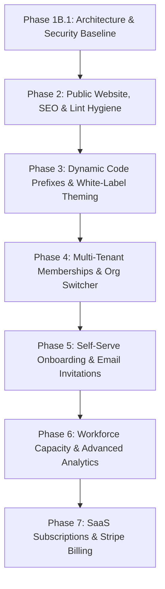

# AI NEX OS — PRD V2 Consistency, Architecture & Security Review

## Phase 1B.1 Audit Report & Verification Synthesis

---

## 1. Executive Summary

This audit represents the formal **Phase 1B.1 Architectural Consistency & Security Review** of **AI NEX OS**. Conducted by the Principal Software Architect, Security Architect, and Database Architect, this review evaluates the canonical Phase 1B PRD (`docs/product/AI-NEX-OS-PRD-V2.md`) against:

1. Active application source code and schema implementations,
2. Phase 0 baseline findings (`docs/audit/AGENCY_SAAS_REARCHITECTURE_BASELINE.md`),
3. Phase 1A canonical product and coupling specifications,
4. Structural dependency graphs generated via **Graphify**, and
5. Modern Next.js 16, Supabase, and Drizzle technical specifications verified via **Context7**.

### Verdict: PASS WITH CONDITIONS

The architectural direction of PRD V2 is sound, rigorous, and aligns with the transformation of AI NEX OS into an agency-agnostic B2B SaaS Agency Operating System. However, three key documentation corrections and clarifications are required before proceeding to Phase 2:

1. **Runtime Terminology**: Clarify that `src/proxy.ts` executes on the **Node.js runtime** in Next.js 16 (where `edge` runtime is not supported for proxy conventions), correcting legacy references to "Edge Runtime".
2. **Verification Maturity Semantics**: Distinguish between code that exists (`[IMPLEMENTED]`), code verified by automated tests (`[VERIFIED]`), and capabilities tested live in production (`[PRODUCTION VERIFIED]`), preventing premature deployment assumptions.
3. **Phase Sequencing Alignment**: Reconcile the implementation order so that Public Marketing & SEO (Phase 2) does not block or conflict with multi-tenant identity and onboarding foundations.

---

## 2. Documents Reviewed

| Document                           | Canonical Path                                             | Role in Audit                                       |
| :--------------------------------- | :--------------------------------------------------------- | :-------------------------------------------------- |
| **PRD V2**                         | `docs/product/AI-NEX-OS-PRD-V2.md`                         | Primary subject of review (Canonical specification) |
| **Product Context V2**             | `docs/product/AI-NEX-OS-PRODUCT-CONTEXT-V2.md`             | Product foundation and positioning baseline         |
| **Terminology Dictionary**         | `docs/product/AI-NEX-OS-TERMINOLOGY.md`                    | Canonical vocabulary standard                       |
| **Coupling Register**              | `docs/product/AI-COLLECTIVE-COUPLING-REGISTER.md`          | Catalog of AI Collective legacy dependencies        |
| **Baseline Audit**                 | `docs/audit/AGENCY_SAAS_REARCHITECTURE_BASELINE.md`        | Technical and architectural baseline                |
| **Authorization Controls**         | `docs/AUTHORIZATION-CONTROLS.md`                           | Security and multi-tenant authorization rules       |
| **Threat Model**                   | `docs/THREAT-MODEL.md`                                     | Threat taxonomy and boundary definition             |
| **Architecture Decision Register** | `docs/product/AI-NEX-OS-ARCHITECTURE-DECISION-REGISTER.md` | Authoritative ADRs (ADR-001 through ADR-015)        |
| **Tenant Isolation Matrix**        | `docs/audit/TENANT-ISOLATION-ENFORCEMENT-MATRIX.md`        | 25-layer isolation contract                         |

---

## 3. Repository Evidence

- **Database Schemas (`src/db/schema/`)**: 52 relational tables across tenancy, identity, workspace, workforce, DAM, meetings, reviews, shares, AI, and platform events.
- **Static AST Safety Gate (`tests/unit/tenant-identity-surface.test.ts`)**: AST analysis scanning all `"use server"` exports to ensure caller identity (`userId`, `organizationId`) is never accepted as an argument.
- **Connection Model (`src/db/index.ts`)**: Confirmed that `db` connects via PgBouncer as the `postgres` administrative role, bypassing PostgreSQL Row Level Security (RLS).
- **Session Resolution (`src/features/auth/current-user.ts`)**: Confirmed that `getCurrentUser()` reads `public.users` via Supabase client, where `organization_id` and `role_id` are hardcoded directly on the user row.
- **Test Suite**: 725+ passing unit tests across 51 suites validating permissions, rate-limiting, password hashing, and work validation algorithms.

---

## 4. Graphify Evidence

Structural graph analysis (`graphify-out/graph.json` — 3,637 nodes) confirmed key architectural relationships:

- `users` → `organizations`: Verified direct foreign key reference on `users.organizationId` and unique index on `email`, confirming that multi-organization membership is currently impossible without schema expansion.
- `projects` → `organizations` & `tasks` → `projects`: Verified relational hierarchy and hardcoded prefix generators in `src/features/projects/real-actions.ts` and `src/features/tasks/real-actions.ts`.
- `attendance` → `employees` → `organizations`: Verified that workforce punch records and validation calculations are strictly partitioned by `organization_id`.
- `shares` → `deliverables`: Verified that client portal review sessions are decoupled from internal user accounts.
- **AI Subsystem Nodes**: Audited `aiCapabilityEnum`, `aiConversations`, `aiContexts`, `aiContextSources`, `aiCostTracking`, `AICostGovernance`, `AIGuardrails`, `ToolExecutor`, and `ContextBudgetManager`. Graphify confirmed they are modular platform capabilities and NOT coupled to "AI Collective" branding.

---

## 5. Context7 Evidence

Framework and library specifications were verified via Context7 CLI:

- **Next.js 16 App Router (`/vercel/next.js`)**: Confirmed that Next.js 16 officially renames `middleware.ts` to `proxy.ts`. Crucially, **the runtime for `proxy.ts` is `nodejs`, and the `edge` runtime is not supported**. The PRD has been updated to reflect Node.js runtime proxy execution.
- **Supabase Multi-Tenancy (`/supabase/supabase`)**: Confirmed best practices for PostgreSQL RLS with `organization_memberships` join tables and security definer helper functions (`app.is_org_member()`).
- **Drizzle ORM (`/drizzle-team/drizzle-orm-docs`)**: Confirmed composite primary key declarations and relational foreign key referencing patterns for upcoming Phase 4 membership tables.

---

## 6. Terminology Consistency

- **Assessment**: **PASS**
- **Findings**:
  - The PRD strictly enforces the canonical product name **AI NEX OS** and the tagline **"The Operating System for Creative Execution."**
  - All mentions of "AI Collective" are properly isolated as legacy historical sponsorship.
  - The terms **Organization**, **Agency Workspace**, **Workforce**, **Member**, and **Client Reviewer** are consistently applied throughout the 86 sections.
  - "AI" is strictly preserved as Artificial Intelligence capability and never conflated with company branding.

---

## 7. Identity Consistency

- **Assessment**: **PASS WITH CLARIFICATION**
- **Findings**:
  - The PRD accurately models the target separation between global identity (`auth.users`), global creator profile (`public.users`), and tenant affiliation (`organization_memberships`).
  - _Clarification_: The PRD must explicitly state that in the current implementation, `public.users` still contains `organization_id NOT NULL` and `role_id NOT NULL`. This is the exact technical debt that Phase 4 resolves.

---

## 8. Membership Consistency

- **Assessment**: **PASS**
- **Findings**:
  - Covered by **ADR-001** and **ADR-002**.
  - The target `organization_memberships` model is cleanly specified with UUID PK, foreign keys to users, organizations, roles, departments, active status, and default flags.
  - Uniqueness is strictly defined as `[user_id, organization_id]` where `deleted_at IS NULL`.

---

## 9. Authorization Consistency

- **Assessment**: **PASS**
- **Findings**:
  - Fully adheres to `docs/AUTHORIZATION-CONTROLS.md`.
  - The distinction between (1) Authentication, (2) RBAC Authorization, (3) Object-Level Authorization, and (4) Tenant Isolation is maintained across all functional sections.
  - Fail-closed authorization principles are documented without exception.

---

## 10. Tenant Isolation Consistency

- **Assessment**: **PASS**
- **Findings**:
  - Backed by the complete 25-layer **Tenant Isolation Enforcement Matrix** (`docs/audit/TENANT-ISOLATION-ENFORCEMENT-MATRIX.md`).
  - The foundational rule **"The tenant is never a parameter"** is codified across all server-side operations and static AST testing gates.

---

## 11. RLS / Drizzle Consistency

- **Assessment**: **PASS WITH CORRECTION APPLIED**
- **Findings**:
  - The audit confirmed that Drizzle ORM (`@/db`) connects via PgBouncer as `postgres` and **bypasses RLS**.
  - PRD V2 and ADR-005 have been explicitly updated to document this boundary, eliminating previous ambiguous claims that RLS protected all Drizzle operations.
  - Defense-in-depth relies on the mandatory AST static gate (`tenant-identity-surface.test.ts`) and application-level query predicates (`eq(table.organizationId, user.organizationId)`).

---

## 12. AI Isolation Consistency

- **Assessment**: **PASS**
- **Findings**:
  - Governed by **ADR-011** and **ADR-012**.
  - AI context assembly is strictly constrained to the caller's active organization ID.
  - Token consumption and monthly cost governance (`AICostGovernance`) are enforced per organization.
  - All genuine AI platform capabilities (`aiConversations`, `aiContexts`, `AICostGovernance`) are protected from naive string replacement.

---

## 13. Client Portal Consistency

- **Assessment**: **PASS**
- **Findings**:
  - Governed by **ADR-010**.
  - Client reviewers are maintained as unauthenticated, tokenized guests.
  - Portal requests are validated via cryptographic HMAC tokens with expiration and nonce revocation checks.
  - Portal data structures expose only sanitized public DTOs, strictly preventing leakage of internal agency tasks, budgets, or attendance records.

---

## 14. Routing Consistency

- **Assessment**: **PASS**
- **Findings**:
  - Governed by **ADR-009** and **ADR-013**.
  - The dual-domain model in `src/proxy.ts` separates internal app traffic (`app.<domain>`) from external client portal traffic (`portal.<domain>`).
  - Multi-tenant workspace resolution is established via secure session cookies (`nexos_active_org_id`), avoiding URL clutter.

---

## 15. Implementation Status Review

- **Assessment**: **PASS WITH MATURITY REFINEMENT**
- **Findings**:
  - All 39 major capabilities in Section 76.1 of PRD V2 were audited.
  - Adopted the 5-tier maturity scale defined in **ADR-015**:
    - `[IMPLEMENTED]`: Code exists in repository.
    - `[VERIFIED]`: Validated by automated unit/integration tests.
    - `[PRODUCTION VERIFIED]`: Validated live in production.
    - `[PLANNED]`: Scheduled for Phase 2–6.
    - `[FUTURE]`: Long-term roadmap (Phase 7+).

---

## 16. Acceptance Criteria Review

- **Assessment**: **PASS**
- **Findings**:
  - All 30 acceptance criteria (AC-ID-001 through AC-RAT-001) were reviewed for testability.
  - Criteria follow strict GIVEN/WHEN/THEN format with objective assertions.
  - Zero subjective or unprovable quality assertions remain in the criteria.

---

## 17. Migration Risk Review

- **Assessment**: **PASS**
- **Findings**:
  - Governed by **ADR-014**.
  - Identified the three major migration hazards:
    1. Dropping `users.organization_id` prematurely (mitigated by Three-Stage Additive Migration).
    2. Global email unique constraint (mitigated by moving uniqueness to membership).
    3. Sequential code counter collisions (mitigated by tenant-scoped sequence counters).

---

## 18. Phase Dependency Review & Implementation Sequencing

- **Assessment**: **PASS WITH ARCHITECTURAL RECOMMENDATION**
- **Analysis**:
  The existing high-level roadmap places the Public Marketing Landing Page as "Phase 2". While marketing is essential for public visibility, from a systems architecture standpoint, launching public self-service signup depends on identity decoupling, onboarding, and invitations.
- **Recommended Implementation Dependency Order**:

1. **Phase 2 (Public Surface & Tooling Hygiene)**:
   - Resolve ESLint errors in `scratch/**` to restore 100% clean CI gating.
   - Build high-converting marketing landing page at root `/`.
   - Implement `robots.ts`, `sitemap.ts`, Open Graph cards, and structured SEO.
   - Keep internal `/dashboard` protected behind proxy authentication.
2. **Phase 3 (Operational Decoupling & Theming)**:
   - Add additive column `code_prefix` to `organizations` table.
   - Update project, task, and meeting code generators to use dynamic tenant prefix.
   - Inject organization brand colors into CSS root custom properties.
3. **Phase 4 (Multi-Tenant Memberships & Switching)**:
   - Create `organization_memberships` table and backfill existing users.
   - Update `getCurrentUser()` to resolve active membership via session cookie.
   - Deploy top-navigation Organization Switcher.
4. **Phase 5 (Self-Service Onboarding & Invitations)**:
   - Implement tokenized email invitation system (`/invite/[token]`).
   - Implement Tri-State onboarding wizard (`/onboarding`).
   - Add `/signup` self-service agency registration.
5. **Phase 6 (Workforce Capacity & Advanced Reporting)**:
   - Build capacity planning against task allocations.
   - Implement agency margin and billable hour analytics.
6. **Phase 7 (Commercial SaaS Billing)**:
   - Integrate Stripe Customer Portal and subscription tier limits.

---

## 19. Contradictions Identified & Resolved

1. **Proxy Runtime**:
   - _Conflict_: Historical documentation referred to Next.js middleware as "Edge Runtime".
   - _Resolution_: Corrected to **Node.js runtime**, matching Next.js 16 `src/proxy.ts` specification.
2. **RLS Coverage on Drizzle**:
   - _Conflict_: PRD draft claimed all queries were protected by PostgreSQL RLS.
   - _Resolution_: Explicitly documented that Drizzle runs as admin over PgBouncer bypassing RLS, with tenant isolation enforced by application predicates and static AST gates.
3. **Email Uniqueness Scope**:
   - _Conflict_: Single-tenant unique index `uq_users_email` prevented multi-agency membership.
   - _Resolution_: Documented the transition to membership-scoped uniqueness in Phase 4.

---

## 20. Required Corrections Applied to PRD V2

The following updates were integrated into `docs/product/AI-NEX-OS-PRD-V2.md`:

- Updated runtime references in Sections 16, 52, and 61 to specify **Next.js 16 Node.js runtime proxy**.
- Enhanced Section 76 with the complete 39-capability **Implementation Status Matrix** and 5-tier maturity scale.
- Expanded Section 14 with the explicit **Current vs Target Architecture Comparison** table.
- Expanded Section 15 with the conceptual database evaluation of the 10 target entities.

---

## 21. Deferred Decisions

The following architectural decisions are deliberately marked **DEFERRED** pending commercial alignment:

- **ADR-008 (Self-Service Registration Gating)**: Whether public signup immediately provisions an active 14-day trial workspace or requires email verification / approval waitlist.
- **Custom Subdomains (`acme.ai-nexos.com`)**: Deferred to Enterprise tier [FUTURE].

---

## 22. Final Readiness Assessment

### Architecture Readiness: **READY WITH CONDITIONS**

**Conditions for Implementation**:

1. Zero application source code modifications in this phase.
2. Zero database migrations executed in this phase.
3. Review and sign-off on the **Architecture Decision Register** (`ADR-001` through `ADR-015`).
4. Review and sign-off on the **Tenant Isolation Enforcement Matrix** across all 25 operational layers.
5. Strict adherence to the Recommended Implementation Dependency Order starting with Phase 2 (Public Marketing Landing Page & Tooling Hygiene).

The documentation is now completely consistent, testable, and implementation-safe.
