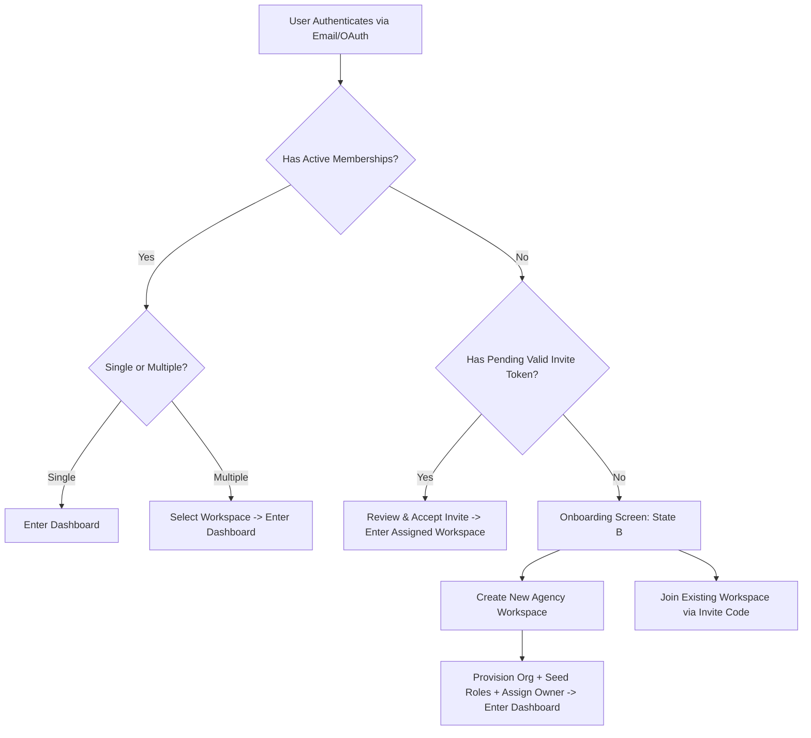

# AI NEX OS — Canonical Product Requirement Document (PRD v2.0)
## The Operating System for Creative Execution
### Agency-Agnostic Multi-Tenant B2B SaaS Architecture & Specification

---

## 1. Document Control

| Attribute | Specification Detail |
| :--- | :--- |
| **Document Name** | AI NEX OS Canonical Product Requirement Document (PRD V2) & Target Architecture Requirements |
| **Canonical File Path** | `docs/product/AI-NEX-OS-PRD-V2.md` |
| **Document Version** | 2.0.0 (Phase 1B Canonical Milestone) |
| **Document Status** | **CANONICAL PRODUCT REQUIREMENT DOCUMENT · PHASE 1B AUTHORITATIVE** |
| **Publication Date** | September 26, 2026 |
| **Owner / Lead Architect** | Antigravity AI Engineering Assistant & Core Platform Team |
| **Target Repository Root** | `ai-nexos` (`NEXOS Comb / AIC NEXOS / ai-nexos`) |
| **Implementation Git Branch** | `phase-2-production-readiness` |
| **Target Production Host** | `https://ai-nexos.antideploy.com` |
| **Superseded Documents** | `DOCS/AIC NexOS (PRD).md`, `DOCS/AIC Nex OS (SDS).md`, `DOCS/AIC Nex OS (TRD) .md`, `DOCS/AIC Nex OS (DBD).md` |
| **Authoritative Baselines** | `docs/audit/AGENCY_SAAS_REARCHITECTURE_BASELINE.md`<br>`docs/product/AI-NEX-OS-PRODUCT-CONTEXT-V2.md`<br>`docs/product/AI-NEX-OS-TERMINOLOGY.md`<br>`docs/product/AI-COLLECTIVE-COUPLING-REGISTER.md`<br>`docs/AUTHORIZATION-CONTROLS.md` |
| **Scope & Phase Boundary** | **PHASE 1B DOCUMENTATION-ONLY**. Strictly non-mutating. Zero source modifications, zero database mutations, zero deployments, zero secrets rotation. Defines target architecture and requirements for Phase 2+ execution. |

---

## 2. Executive Summary

**AI NEX OS** is the unified **Agency Operating System (Agency OS)** purpose-built for creative agencies, video production houses, branding studios, and digital consultancies. Known by its canonical tagline, **"The Operating System for Creative Execution,"** AI NEX OS consolidates the three historically fragmented operational pillars of creative service businesses into one coherent system of record:

1. **Workspace Operations**: Project governance, timeline milestones, deliverable versioning, itemized revisions, file digital asset management (DAM), and context-bound decision meetings.
2. **Client Collaboration**: Frictionless, zero-login, cryptographically authenticated client review portals that eliminate feedback ambiguity and streamline client sign-off without forcing client account creation.
3. **Workforce Operations**: Granular employee directory, department structures, verified shift punch-clocks, algorithmic work-validation, and manager review queues.

### Why AI NEX OS Is Being Rearchitected
Originally prototyped with sponsorship from "AI Collective (AIC)" as a dedicated internal agency tool, the platform established exceptional engineering foundations: Next.js 16 App Router architecture, 52 relational tables in PostgreSQL via Drizzle ORM, strict runtime environment guards, an AST-based static safety gate preventing caller-supplied tenant IDs (`tests/unit/tenant-identity-surface.test.ts`), and 725+ passing unit tests.

However, the prototype embodied a single-tenant mental model:
- `public.users` directly references a single mandatory `organization_id NOT NULL` with a global unique email constraint (`uq_users_email`), precluding multi-organization membership and agency switching.
- Core action generators hardcode the `AIC-` prefix into project codes (`AIC-YYYY-XXXX`), task codes (`AIC-T-YYYY-XXXX`), and meeting action items.
- Root routing immediately redirects to `/dashboard` or `/login`, lacking a public marketing presence, pricing, and SEO infrastructure.
- User onboarding is non-existent; unprovisioned authenticated identities are halted at an unprovisioned error screen (`/unprovisioned`).

This PRD V2 formally defines the transformation of AI NEX OS into an **agency-agnostic, multi-tenant B2B SaaS platform** where the customer is the **Organization (Tenant)**, artificial intelligence is an **assistive capability layer**, and creative teams worldwide can self-serve, manage multiple agency tenancies, collaborate with clients seamlessly, and scale their production operations securely.

---

## 3. Product Vision

To become the global operational standard and indispensable digital backbone for creative execution—freeing creative directors, producers, designers, and agency executives from administrative chaos, fragmented tooling, and client approval friction so they can execute with uncompromising velocity, transparency, and craft.

---

## 4. Product Mission

To replace the fragile web of spreadsheets, disconnected messaging apps, fragmented cloud storage drives, and scattered email threads with a single, intelligent, highly aesthetic operating system that binds every creative asset to its client, creator, task, timeline, cost, and legal sign-off.

---

## 5. Product Positioning

```
┌─────────────────────────────────────────────────────────────────────────┐
│                              AI NEX OS                                  │
│              The Operating System for Creative Execution                │
└────────────────────────────────────┬────────────────────────────────────┘
                                     │
         ┌───────────────────────────┼───────────────────────────┐
         ▼                           ▼                           ▼
┌──────────────────┐       ┌──────────────────┐       ┌──────────────────┐
│    Workspace     │       │   Client Share   │       │    Workforce     │
│    Operations    │       │     Portals      │       │    Operations    │
│ (Production/CRM) │       │ (Zero-Login Hub) │       │ (Validation/HR)  │
└──────────────────┘       └──────────────────┘       └──────────────────┘
```

- **Agency-Agnostic Core**: The platform serves any creative, media, design, or production company. The platform is not tied to AI Collective or any single entity.
- **AI as an Accelerator, Not the Customer**: Artificial intelligence is an assistive capability layer (summarizing meetings, extracting revision tasks, analyzing project risks, and assisting creative ideation), never the definition of the customer.
- **High-Aesthetic Swiss Execution**: Minimalist dark-tech visual language, high typographic contrast (Geist Sans / Geist Mono), zero-latency client state, and responsive desktop/tablet/mobile layouts.
- **Frictionless Client Perimeter**: Agency staff operate within an authenticated, role-gated workspace; clients interact through secure, branded, single-use or expiring share links without onboarding hurdles.

---

## 6. Target Market

The addressable market encompasses global commercial creative services and high-velocity digital production organizations:
- Independent Creative & Design Agencies (5–250 employees)
- Full-Service Advertising & Media Agencies
- Video Production Studios & VFX Houses
- Brand Strategy & Digital Product Consultancies
- AI-Native Creative Studios & Content Synthesizers
- In-House Enterprise Creative & Brand Marketing Divisions
- Boutique Architecture, Fashion, and Industrial Design Studios

---

## 7. Target Organization Types

1. **Creative & Advertising Agencies**: Require end-to-end campaign tracking, pitch decks, copy revisions, client sign-offs, and multi-department scheduling.
2. **Design & Branding Studios**: Require visual asset reviews, brand guideline management, version comparison, and tokenized client approvals.
3. **Video Production Houses**: Require frame-accurate feedback, video streaming reviews, dailies distribution, and shift time tracking for post-production crew.
4. **AI-Native Content Studios**: High-volume asset creation, automated variant testing, prompt engineering workflows, and token budget governance.
5. **In-House Enterprise Creative Teams**: Multi-brand governance, internal stakeholder review workflows, capacity management, and corporate directory alignment.

---

## 8. Personas

### 8.1 Internal Agency Personas
- **Agency Owner / Partner (`owner`)**:
  - *Focus*: Margin, agency capacity, client retention, executive accountability.
  - *Authority*: Unrestricted administrative, financial, and tenant-level destruction governance.
- **Super Administrator (`super_admin`)**:
  - *Focus*: Security compliance, user lifecycle, department topology, billing, audit logging.
  - *Authority*: Platform configuration excluding sole-owner demotion/deletion.
- **Creative Director (`creative_director`)**:
  - *Focus*: Quality control, aesthetic cohesion, deliverable reviews, creative assignments.
  - *Authority*: Project, deliverable, and revision approval authority; creative review sign-off.
- **Project Manager / Producer (`project_manager`)**:
  - *Focus*: Timelines, deliverable milestones, task assignments, client communications, meeting minutes.
  - *Authority*: Task, timeline, project, meeting, and share link management.
- **Creative Team Member (`team_member`)**:
  - *Focus*: Task clarity, asset downloads, revision checklists, time recording, daily punch clock.
  - *Authority*: Scoped task execution, revision uploads, individual time/attendance logging.
- **HR / Operations Lead (`hr`)**:
  - *Focus*: Shift compliance, attendance punches, punch corrections, leave tracking, employee directory.
  - *Authority*: Workforce management, attendance review queue approval, employee profile maintenance.
- **Finance Lead (`finance`)**:
  - *Focus*: Billable hours, project budgets, contractor timesheets, client invoice reconciliation.
  - *Authority*: Financial reports, time audit logs, read-only project and client budget data.

### 8.2 External Client Personas
- **Client Executive / Brand Sponsor**:
  - *Focus*: Milestone delivery, macro budget tracking, formal contract sign-off.
  - *Interaction*: High-level summary view on branded share portal; formal approval with legal note.
- **Client Creative Reviewer**:
  - *Focus*: Detailed asset inspection, frame/timestamp annotations, itemized change requests.
  - *Interaction*: Interactive review canvas on zero-login tokenized share portal.

---

## 9. Jobs To Be Done (JTBD)

1. **When managing multi-phase creative campaigns**, I want a single source of truth connecting briefs, tasks, timelines, and deliverables, so that our team never drops a deadline or misplaces an asset version.
2. **When sharing work with demanding clients**, I want to provide a zero-login, high-aesthetic review link where they can leave pinpoint feedback and formal approvals, so that we eliminate revision ambiguity and email sprawl.
3. **When tracking creative workforce operations**, I want verified punch-clock attendance and automated effective-hour calculation tied to business days, so that we maintain accurate operational records without intrusive monitoring software.
4. **When running multiple client accounts or freelance rosters**, I want team members to belong to multiple agency workspaces using a single authenticated identity, so that cross-agency collaboration is frictionless.
5. **When onboarding a new agency**, I want founders to create a workspace in under 60 seconds with automated system roles and custom branding, so that time-to-value is instantaneous.

---

## 10. Core Problems

1. **Tooling Fragmentation**: Agencies juggle Asana (tasks), Frame.io (reviews), Google Drive (storage), Slack (chat), Toggl (time), and DocuSign (approvals), losing context across boundaries.
2. **Client Login Resistance**: External clients refuse to create accounts or learn complex internal project software, reverting to messy, untracked WhatsApp and email chains.
3. **Revision Scope Creep**: Lack of structured, itemized revision records leads to unbilled out-of-scope work and dispute over sign-offs.
4. **Workforce Disconnect**: Project management is detached from actual staff availability, attendance, and capacity.
5. **Single-Tenant Identity Lock-in**: Current implementation limits an authenticated email to exactly one organization, blocking agency freelancers and enterprise multi-brand agencies.

---

## 11. Product Principles

1. **The Tenant Is Never a Parameter**: Multi-tenant boundaries are derived exclusively from cryptographically verified server-side session claims, never from client-supplied request parameters or form fields.
2. **Single Unified System of Record**: Projects, deliverables, revisions, tasks, files, meetings, and attendance live in one relational data hierarchy.
3. **Zero Client Friction**: External clients collaborate with zero onboarding friction via authenticated, revocable, scoped share links.
4. **Design Excellence**: Software for creative professionals must look world-class—engineered with Swiss precision, typographic balance, and fluid interactions.
5. **Immutable Auditability**: All operational mutations, approvals, revision submissions, and punch records generate immutable activity logs.
6. **Resilient Autonomy**: Core operations execute without latency; AI capabilities accelerate human work but never block operational flow during third-party outages.

---

## 12. Product Boundaries (What AI NEX OS Is NOT)

- **NOT a Creative Creation Tool**: Does not replace Figma, Premiere Pro, After Effects, or Blender. It manages the metadata, versions, feedback, and approvals of outputs created in those tools.
- **NOT an "AI Collective Only" App**: Strictly agency-agnostic B2B SaaS.
- **NOT an AI Agency Management Tool**: AI does not define the business; AI is an assistive platform layer.
- **NOT a Consumer Social Media Auto-Poster**: Does not publish posts directly to Instagram or TikTok.
- **NOT an Unauthenticated Internal Workspace**: Internal workspace actions strictly enforce session verification, RBAC, and tenant scoping.

---

## 13. Organization Model

The **Organization (`public.organizations`)** is the sovereign commercial tenant in AI NEX OS:
- **Tenancy Boundary**: Every business entity (clients, projects, tasks, deliverables, files, meetings, attendance, activity logs) belongs to exactly one organization.
- **Attributes**:
  - `organization_id` (UUID PK): Global internal tenant identifier.
  - `organization_name` (Text): Commercial display name.
  - `slug` (Text Unique): URL-safe identifier for tenant routing and workspaces.
  - `code_prefix` (Text): 2–6 character uppercase prefix (e.g., `NEX`, `ACME`) governing project, task, and employee code generation.
  - `timezone` (Text): Canonical IANA timezone governing workforce business-day boundary calculation.
  - `currency` (Text): Default ISO currency code.
  - `brand_primary_color` & `brand_secondary_color`: Hex/OKLCH tokens for workspace and portal theming.
  - `logo_url` & `favicon_url`: Organization brand assets stored in isolated storage buckets.
- **Sequences (`public.organization_sequences`)**:
  - Maintains monotonic integer counters per tenant and entity type (`project_code`, `task_code`, `employee_code`) using composite PK `[organization_id, entity_type]`.

---

## 14. Identity Model

AI NEX OS enforces strict separation between global identity and tenant authorization:
```
┌────────────────────────────────────────────────────────┐
│             Supabase Auth (`auth.users`)               │
│        Global Authentication Identity (UUID, Email)     │
└───────────────────────────┬────────────────────────────┘
                            │ 1:1
┌───────────────────────────▼────────────────────────────┐
│                 User Profile (`public.users`)          │
│       Global Creator Account (Name, Avatar, Phone)     │
└───────────────────────────┬────────────────────────────┘
                            │ 1:N
┌───────────────────────────▼────────────────────────────┐
│             `organization_memberships` (Target)        │
│          Tenant Affiliation, Role, Status, Default     │
└────────────────────────────────────────────────────────┘
```
- **Global Identity**: An authenticated identity represents an individual human creator in Supabase Auth.
- **Decoupled Profile**: `public.users` contains creator biographical metadata (first name, last name, avatar, bio).
- **Independence**: Changing an individual's personal email or profile details does not alter their historical audit records across organizations.

### 14.1 Current vs Target Architecture Comparison

| Architectural Dimension | Current Implementation (Baseline) | Target SaaS Architecture (V2) |
| :--- | :--- | :--- |
| **Identity Entity** | Supabase Auth (`auth.users`) tied 1:1 to `public.users` | Supabase Auth (`auth.users`) as global auth identity; `public.users` as global creator profile |
| **Application User** | `public.users` stores `organization_id NOT NULL`, `role_id NOT NULL`, and `department_id` directly on the row | `public.users` contains only identity/profile fields; all tenancy and permissions are decoupled |
| **Organization (Tenant)** | Single-tenant bias; seeded via `.env.example` (`SEED_ORG_NAME="AI Collective"`) and `scripts/seed.ts` | Fully autonomous B2B SaaS tenant provisioned dynamically via self-serve onboarding or admin invitation |
| **Membership Relationship** | Implicit 1:1 relationship hardcoded on `users` table | Explicit M:N relationship governed by `organization_memberships` join table |
| **Multiple Organizations** | Strictly unsupported; database enforces unique constraint `uq_users_email` globally on `public.users` | Fully supported: 1 global identity can hold active memberships in N independent agency organizations |
| **Onboarding Experience** | Unavailable; unprovisioned authenticated users are bounced to a hostile error screen at `/unprovisioned` | Canonical Tri-State Onboarding: State A (Active Member), State B (Create/Join Org), State C (Accept Invite) |
| **Invitation Lifecycle** | Disabled; `realEmployeeAdminRepository.create()` explicitly throws: `"wired in Phase 7"` | First-class cryptographic token lifecycle: invite creation, email dispatch, redemption, and membership binding |
| **Roles & Authority** | Global to user record (`users.role_id`), cannot vary across organizations | Organization-scoped (`organization_memberships.role_id`); user can be Owner in Org A and Designer in Org B |
| **Permissions Evaluation** | Evaluated against `user.permissions` derived from single organization role | Evaluated dynamically against the caller's active organization membership role |
| **Organization Switching** | Non-existent; requires manual database mutation or logging out into another account | Native top-navigation organization switcher dropdown backed by secure HTTP-only session context cookie |
| **Sequential Identifiers** | Hardcoded prefixes: `AIC-YYYY-XXXX` (projects), `AIC-T-YYYY-XXXX` (tasks), `AIC-0001` (employees) | Dynamic tenant prefix: `{organization.code_prefix}-YYYY-XXXX` (defaulting to `NEX-`) |
| **Client Portal Surface** | Domain-separated proxy rewrite (`portal.domain/s/{token}`) with zero-login signed token access | Preserved and hardened: zero-login cryptographic token validation with fine-grained action auditing |

---

## 15. Membership Model & Target Database Architecture

The target membership model establishes an explicit M:N bridge between users and organizations:
- **Entity**: `organization_memberships`
  - `membership_id` (UUID PK)
  - `user_id` (UUID FK → `public.users.user_id`)
  - `organization_id` (UUID FK → `public.organizations.organization_id`)
  - `role_id` (UUID FK → `public.roles.role_id`)
  - `department_id` (UUID FK → `public.departments.department_id`, nullable)
  - `status` (`'active' | 'invited' | 'suspended'`)
  - `is_default` (Boolean)
  - `created_at`, `updated_at`, `deleted_at`
- **Multi-Membership Capability**: A user can be an `owner` of Agency A, a `project_manager` in Agency B, and a `team_member` in Agency C.
- **Active Membership Resolution**: Handled via server-side session cookies validated against active memberships.

### 15.1 Conceptual Target Database Entities Evaluation

The following 10 core entities define the conceptual target relational architecture. **Note: In accordance with Phase 1B rules, these entities are documented conceptually; no migrations or schema changes are executed in this phase.**

#### 1. `users` / `identities`
- **Why It Exists**: Represents the global human creator profile, holding personal biographical details independent of any commercial agency.
- **Relationship**: 1:1 with `auth.users` via `user_id`; 1:N with `organization_memberships`.
- **Ownership**: Owned exclusively by the individual user.
- **Tenant Boundary**: Global platform level. Does not belong to any single organization.
- **Lifecycle**: Created upon initial Supabase Auth registration. Updated by user. Anonymized/deleted upon GDPR user account purge.
- **Migration Implications**: Existing `users` table already has `user_id` mirroring `auth.users.id`. In Phase 4, `organization_id` and `role_id` will transition from mandatory foreign keys to nullable/deprecated columns as memberships take over.

#### 2. `organizations`
- **Why It Exists**: Represents the sovereign commercial tenant (creative agency, production studio, design firm) that purchases subscriptions and owns operational data.
- **Relationship**: 1:N with `organization_memberships`, `clients`, `projects`, `files`, `departments`, `roles`, `organization_sequences`.
- **Ownership**: Subscribing agency customer.
- **Tenant Boundary**: Sovereign root of the tenancy boundary.
- **Lifecycle**: Provisioned during self-service onboarding or admin registration. Suspended upon non-payment. Purged 30 days after contract termination.
- **Migration Implications**: Already exists (`src/db/schema/organizations.ts`). Requires additive column `code_prefix text NOT NULL DEFAULT 'NEX'` in Phase 3.

#### 3. `organization_memberships`
- **Why It Exists**: Normalizes the M:N relationship between global identities and agency tenants, allowing individuals to collaborate across multiple organizations with distinct roles.
- **Relationship**: N:1 with `users`, N:1 with `organizations`, N:1 with `roles`, N:1 with `departments`.
- **Ownership**: Organization owns the membership record; user is the associated identity.
- **Tenant Boundary**: Scoped to `organization_id`.
- **Lifecycle**: Created upon invitation acceptance or organization creation. Suspended or deleted by organization admins without affecting user's other agency memberships.
- **Migration Implications**: New table to be introduced in Phase 4 (`0016_multi_tenant_memberships.sql`). Existing `users` records will be backfilled into `organization_memberships` during migration.

#### 4. `roles`
- **Why It Exists**: Defines named authorization levels (Owner, Super Admin, Creative Director, Project Manager, Team Member, HR, Finance) and their associated permission maps.
- **Relationship**: N:1 with `organizations` (or system-wide defaults); referenced by `organization_memberships`.
- **Ownership**: Organization owns custom roles; platform seeds standard system roles.
- **Tenant Boundary**: Scoped to `organization_id` (with system roles seeded per organization).
- **Lifecycle**: Seeded automatically during organization provisioning. Editable by Super Admin / Owner.
- **Migration Implications**: Table already exists (`src/db/schema/roles.ts`). No schema alteration required; foreign keys update from `users.role_id` to `organization_memberships.role_id`.

#### 5. `permissions`
- **Why It Exists**: Represents the atomic capabilities across the 22 application modules and 15 operational actions.
- **Relationship**: Defined in TypeScript constants (`src/features/permissions/constants.ts`) and serialized into JSONB within `roles.permissions`.
- **Ownership**: Platform-defined governance specification.
- **Tenant Boundary**: Global capability dictionary.
- **Lifecycle**: Static enum/constant set versioned with application releases.
- **Migration Implications**: Existing JSONB representation (`roles.permissions`) is highly flexible and requires no database schema changes.

#### 6. `role_permissions`
- **Why It Exists**: Evaluated as an alternative relational join table to JSONB.
- **Relationship**: M:N join between `roles` and granular permission definitions.
- **Ownership**: Organization / Role.
- **Tenant Boundary**: Scoped to `organization_id` via role.
- **Evaluation Decision**: **RETAIN JSONB**. The existing JSONB representation in `roles.permissions` (`Record<Module, Action[]>`) performs with zero join overhead, is cached with `CurrentUser`, and is evaluated with high efficiency in both TypeScript (`hasPermission`) and PostgreSQL RLS (`app.has_permission`). A dedicated `role_permissions` table is deemed unnecessary complexity.

#### 7. `invitations` (`organization_invitations`)
- **Why It Exists**: Manages the pre-membership onboarding state, allowing admins to invite collaborators via cryptographically secure, time-bound tokens.
- **Relationship**: N:1 with `organizations`, N:1 with `roles`, N:1 with `departments`, N:1 with `users` (inviter).
- **Ownership**: Owned by the inviting organization.
- **Tenant Boundary**: Scoped to `organization_id`.
- **Lifecycle**: Created by admin. Valid for 7 days. Marked `consumed` upon redemption, or `revoked` by admin.
- **Migration Implications**: New table planned for Phase 5 (`0017_organization_invitations.sql`).

#### 8. `organization_settings`
- **Why It Exists**: Isolates operational parameters (working days, punch tolerances, file size limits, default currencies) from core organization billing/legal attributes.
- **Relationship**: 1:1 with `organizations`.
- **Ownership**: Subscribing agency tenant.
- **Tenant Boundary**: Scoped to `organization_id`.
- **Lifecycle**: Initialized with defaults during tenant provisioning. Updated by organization administrators.
- **Migration Implications**: Can be implemented additively or stored as structured JSONB on `organizations.settings` to minimize relational bloat.

#### 9. `organization_branding`
- **Why It Exists**: Manages agency white-label visual identity (primary color, secondary color, logo URL, favicon URL, email banner, portal custom CSS).
- **Relationship**: 1:1 with `organizations`.
- **Ownership**: Subscribing agency tenant.
- **Tenant Boundary**: Scoped to `organization_id`.
- **Lifecycle**: Managed by agency Owner/Admin.
- **Migration Implications**: Columns `brand_primary_color`, `brand_secondary_color`, `logo_url` already exist on `public.organizations`. Moving them to a separate table is unnecessary; expanding `public.organizations` with `favicon_url` and `portal_banner_url` is the recommended path.

#### 10. `audit_logs` (`activity_logs`)
- **Why It Exists**: Provides an immutable, legally defensible, tamper-evident chronological ledger of all operational events, approvals, mutations, and security actions.
- **Relationship**: N:1 with `organizations`; N:1 with `users` (actor); polymorphically linked to entities (`project`, `task`, `deliverable`, `attendance`).
- **Ownership**: Subscribing organization (read-only); platform compliance.
- **Tenant Boundary**: Strictly scoped by `organization_id`.
- **Lifecycle**: Append-only. RLS forbids updates and deletes. Retained for 365+ days.
- **Migration Implications**: Already fully implemented in `src/db/schema/activity-logs.ts` with complete PostgreSQL RLS append-only policies.

---

## 16. Authentication Model

Authentication establishes **WHO** the caller is:
1. **Supported Providers**:
   - Email & Password (`signInWithPassword`)
   - Magic Link Passwordless OTP (`signInWithOtp`, with `shouldCreateUser: false` for invited users)
   - Google OAuth (`signInWithOAuth`, PKCE flow via `/auth/callback`)
2. **Session Verification**:
   - Managed via Supabase Auth cookies (`@supabase/ssr`).
   - Refreshed on every request through Next.js 16 Node.js runtime proxy (`src/proxy.ts`).
3. **Brute Force Protection**:
   - Independent IP rate-limiting (10 requests/minute) and account rate-limiting (5 requests/minute) via `src/lib/security/rate-limit.ts`.
4. **Authentication ≠ Authorization**:
   - Proving identity via OAuth or password grants **ZERO** application permissions.
   - An authenticated user without an active organization membership has zero tenant access.

---

## 17. Authorization Model

Authorization establishes **WHAT** the caller may access. As codified in `docs/AUTHORIZATION-CONTROLS.md`, every request must satisfy the **Four Authorization Controls**:

```
┌────────────────────────────────────────────────────────────────────────┐
│                      Control 1: Authentication                         │
│               Is there a caller, and who are they?                     │
│               `requireCurrentUser()` -> verified user identity         │
└───────────────────────────────────┬────────────────────────────────────┘
                                    ▼
┌────────────────────────────────────────────────────────────────────────┐
│                      Control 2: RBAC Authorization                     │
│               May this role perform this kind of operation?            │
│               `requirePermission(user.permissions, module, action)`    │
└───────────────────────────────────┬────────────────────────────────────┘
                                    ▼
┌────────────────────────────────────────────────────────────────────────┐
│                  Control 3: Object-Level Authorization                 │
│               Is this particular record this caller's to touch?        │
│               Ownership check (e.g., reviewer_id === user.userId)      │
└───────────────────────────────────┬────────────────────────────────────┘
                                    ▼
┌────────────────────────────────────────────────────────────────────────┐
│                      Control 4: Tenant Isolation                       │
│               Does this record belong to caller's organization?        │
│               `eq(table.organizationId, user.organizationId)`          │
└────────────────────────────────────────────────────────────────────────┘
```

- **Fail-Closed Principle**: Any missing check results in an immediate HTTP 403 Forbidden or Server Action exception redirecting to `/unauthorized`.
- **Tenant Scoping**: All mutations and queries filter by the active tenant ID resolved from the authenticated session.

---

## 18. Roles

AI NEX OS ships with seven canonical system roles seeded into `public.roles`:

| Role Key | Role Name | Primary Authority | Permission Map Summary |
| :--- | :--- | :--- | :--- |
| `owner` | Organization Owner | Total operational, administrative, and legal governance | `{"*": ["*"]}` |
| `super_admin` | Super Administrator | Operational configuration, user provisioning, departments | Full access across all modules; cannot demote sole owner |
| `creative_director` | Creative Director | Quality assurance, deliverable sign-offs, creative review | Full permissions on `projects`, `tasks`, `deliverables`, `revisions`, `approvals` |
| `project_manager` | Project Manager | Execution schedules, client contact, task assignment | Full on `clients`, `projects`, `timelines`, `tasks`, `meetings`, `shares` |
| `team_member` | Team Member | Creative asset production, task updates, punch clock | Read assigned resources; update assigned tasks; clock in/out |
| `hr` | Human Resources | Workforce administration, punch corrections, directory | Full on `attendance`, `corrections`, `users` (view/edit); review queue authority |
| `finance` | Finance Lead | Time logs, billable tracking, client budgets | Read-only access to `clients`, `projects`, `tasks`, `reports`, `analytics` |

---

## 19. Permissions

- **Topology**: 22 Modules × 15 Actions.
- **Modules**: `organization`, `departments`, `users`, `roles`, `clients`, `projects`, `timeline`, `tasks`, `deliverables`, `approvals`, `revisions`, `files`, `meetings`, `comments`, `notifications`, `reports`, `analytics`, `share_links`, `ai`, `settings`, `attendance`, `corrections`.
- **Actions**: `read`, `create`, `update`, `delete`, `comment`, `approve`, `review`, `upload`, `download`, `share`, `export`, `restore`, `archive`, `clock`, `view_team`.
- **Structure**: JSONB object stored in `roles.permissions`: `Record<Module | "*", (Action | "*")[]>`.
- **Engine Parity**:
  - TypeScript runtime: `hasPermission(permissions, module, action)` in `src/features/permissions/engine.ts`.
  - Database engine: `app.has_permission(p_module text, p_action text)` in PostgreSQL RLS policies.

---

## 20. Organization Switching

In the target multi-tenant architecture:
- Users belonging to multiple organizations can seamlessly toggle active tenant context via an **Organization Switcher** in the top navigation bar.
- Switching updates the secure HTTP-only tenant context cookie.
- The server validates that the user possesses an `active` membership in the requested organization before switching.
- Switching does not require re-authentication.

---

## 21. Onboarding

AI NEX OS implements the canonical **Tri-State Onboarding Model**:



- **State A (Existing Member)**: Resolves default membership and enters `/dashboard`.
- **State B (Unaffiliated User)**: Presented with two clear paths:
  1. *Create Agency Workspace*: Name agency, select URL slug, pick code prefix, choose timezone → provisions organization, seeds default system roles, assigns creator as `owner`, redirects to dashboard.
  2. *Join Existing Agency*: Enter invitation code or request admin invitation.
- **State C (Pending Invitee)**: Resolves invitation token, shows agency invitation card (Agency Name, Inviter, Role), accepts invitation → binds membership and enters workspace.

---

## 22. Invitations

- **Lifecycle**:
  1. Admin invites member via email with assigned `role_id` and optional `department_id`.
  2. System generates an HMAC-signed, single-use, 7-day expiring invitation token stored in `organization_invitations`.
  3. System dispatches email with redemption link: `/invite/[token]`.
  4. Invitee opens link:
     - If unauthenticated: Signs up or logs in.
     - If authenticated: Confirms acceptance.
  5. System validates token, ensures email match (or logs acceptance audit if email differs), creates `organization_memberships` record with `active` status, and marks token as `consumed`.
- **Revocation**: Admins can revoke pending invitations at any time before redemption.

---

## 23. Account Lifecycle

- **Creation**: User registers via Email/Password, Magic Link, or Google OAuth. Creates a global `auth.users` row and matching `public.users` profile.
- **Profile Maintenance**: User can update personal name, avatar, phone, and profile timezone.
- **Deactivation**: Deactivating an account terminates active sessions globally and suspends all memberships.
- **Deletion**: GDPR/CCPA compliant hard deletion anonymizes personal identity while preserving tenant project history through surrogate keys.

---

## 24. Organization Lifecycle

- **Provisioning**: Created via self-service onboarding or platform admin. Initializes default settings, sequences, and system roles.
- **Active State**: Standard operational state. All modules functional.
- **Suspension**: Triggered by payment failure, terms violation, or owner request. Workspace switches to read-only mode for members; client share links can be configured to remain active or freeze.
- **Archival / Deletion**: 30-day grace period during which owner can export tenant data (JSON/ZIP). Deletion permanently removes organization assets and cascading records.

---

## 25. Workspace Module

The **Workspace** encompasses all project management and creative production capabilities:
- **Routes**: `/dashboard`, `/projects`, `/clients`, `/tasks`, `/timeline`, `/deliverables`, `/files`, `/meetings`, `/calendar`.
- **Shell**: Wrapped in `AppShell` with dynamic sidebar navigation filtered by caller's permissions.
- **State Management**: React Query for server cache invalidation, Zustand for client state, and Server Actions for data mutations.

---

## 26. Client Management

- **CRM for Creative Agencies**: Manages client companies and their designated contacts.
- **Data Model**: `public.clients` stores `organization_id`, `client_name`, `client_code`, `status`, `brand_color`, `website`, `billing_address`.
- **Contacts**: Supports multiple client contacts with email, phone, role, and portal notification preferences.
- **Project Association**: Every project is linked to a client, aggregating project status, open deliverables, and total billable activity.

---

## 27. Project Management

- **Project Entities**: `public.projects` scoped by `organization_id` and linked to `client_id`.
- **Sequential Project Codes**: Auto-generated via `organization_sequences`. Target format: `{ORG_PREFIX}-YYYY-XXXX` (replacing hardcoded `AIC-YYYY-XXXX`).
- **Core Attributes**: Name, code, description, project manager ID, budget, currency, start/end dates, priority, status (`planning`, `in_progress`, `in_review`, `on_hold`, `completed`, `cancelled`).
- **Project Members**: `public.project_members` associates organization members with specific project roles and access flags.

---

## 28. Task Management

- **Task Execution**: Kanban board, list view, and detail drawers.
- **Task Codes**: Auto-generated sequential codes: `{ORG_PREFIX}-T-YYYY-XXXX`.
- **Relationships**: Linked to `project_id`, `parent_task_id` (subtasks), assignees, reviewers.
- **Work Tracking**: Integrated timer for logging time entries directly against tasks into `task_time_entries`.
- **Dependencies**: Finish-to-start, start-to-start dependencies tracked in `task_dependencies`.

---

## 29. Timeline & Milestones

- **Gantt Visualization**: Interactive visual timeline showing project phases, milestones, and task schedule spans.
- **Entities**: `timelines`, `project_phases`, `milestones`, `timeline_dependencies`.
- **Dependencies & Critical Path**: Automatic dependency validation preventing circular milestone dependencies.

---

## 30. Deliverables

- **Creative Asset Production**: Represents the core output of an agency (video edit, brand guidelines, social campaign suite, 3D model).
- **Entities**: `public.deliverables` and `public.deliverable_files`.
- **Attributes**: Deliverable name, type (video, image, document, audio, code), target specs, version number, review status (`draft`, `in_internal_review`, `in_client_review`, `revisions_requested`, `approved`).

---

## 31. Reviews

- **Review Sessions**: Structured review cycles created for internal leads or external client reviewers.
- **Interactive Review Canvas**: Frame-accurate video playback, high-res image zoom, PDF multi-page navigation.
- **Timestamped Annotations**: Comments anchored to exact video timecodes (`00:02:14:12`) or image coordinates (`{x: 0.42, y: 0.68}`).

---

## 32. Approvals

- **Formal Sign-off Engine**: Approvals represent binding operational decisions, not informal chat reactions.
- **Data Model**: `deliverable_approvals` logs decision (`approved`, `rejected`), decision-maker identity, version stamp, signature note, IP address, and user agent.
- **Multi-Stage Approval Workflows**: Supports sequential approval gates (e.g., Step 1: Creative Director Approval → Step 2: Client Legal Sign-off).

---

## 33. Revisions

- **Itemized Revision Management**: Revisions translate vague feedback into structured, actionable items.
- **Data Model**: `revisions` and `revision_items`.
- **Checklist Engine**: Team members mark individual revision items as resolved with attached proof files before submitting a new deliverable version.
- **Merge & Diff Previews**: Side-by-side visual comparison between Version N and Version N-1.

---

## 34. Files & Assets

- **Digital Asset Management (DAM)**: Cloud file storage backed by Supabase Storage (`NEXT_PUBLIC_SUPABASE_STORAGE_BUCKET`).
- **Hierarchy**: Organization → Folders → Files → File Versions.
- **Security**: Files stored with organization prefix: `/{organization_id}/{file_id}`.
- **Metadata**: Content hashing (`sha256`), MIME type, byte size, resolution, color space, duration.

---

## 35. Meetings

- **Context-Bound Meeting Hub**: Agendas, real-time minutes, decisions, and action items.
- **One-Click Promotion**: Meeting action items convert directly into tasks with auto-generated sequential codes.
- **Decision Registry**: `meeting_decisions` links decisions to impacted projects, deliverables, and timelines.

---

## 36. Communication

- **Artifact-Bound Threads**: Discussions are pinned to specific tasks, deliverables, or meetings to preserve context.
- **Audience Partitioning**: Comments are explicitly partitioned into `internal` (workspace members only) and `client` (visible on external share portals).

---

## 37. Notifications

- **In-App Notification Center**: Real-time notification bell with unread counters and category filters.
- **Dispatch Channels**: In-app notifications, transactional emails, and webhook events.
- **Preferences**: Granular per-user notification preferences stored in `notification_preferences`.

---

## 38. Workforce

The **Workforce** domain governs people operations, employee records, and verified shift attendance:
- **Unified Identity**: Uses the same user accounts and organization memberships as Workspace modules.
- **Integrated Capacity**: Connects employee schedules and logged time directly to project delivery.

---

## 39. Employees

- **Employee Directory**: Profile, designation, department, employment type (full-time, part-time, contractor), joining date, and working hours schedule.
- **Sequential Employee Code**: Auto-generated format: `{ORG_PREFIX}-XXXX` (e.g., `NEX-0001`).

---

## 40. Departments

- **Organizational Structure**: `public.departments` represents agency teams (Creative, Design, Video, Development, Operations, Leadership).
- **Tenant Scoped**: Departments are fully isolated per organization.

---

## 41. Attendance

- **Shift Punch-Clock**:
  - `clock_in`: Starts shift, stamps UTC timestamp and resolves organization business day.
  - `break_start` / `break_end`: Logs pauses categorized as paid (short break) or unpaid (lunch).
  - `clock_out`: Ends shift, triggers automated duration and validation processing.
- **Timezone Discipline**: Business days are evaluated strictly against the organization's canonical timezone (`organizations.timezone`).

---

## 42. Attendance Corrections

- **Correction Submission**: Employees can request punch adjustments for missed clocks with required written justification.
- **Review Queue (`/workforce/corrections/review`)**: Managers and HR review, approve, or reject corrections with full audit logging.

---

## 43. Capacity & Availability

- **Availability Engine**: Compares configured working hours against approved attendance records and task allocations to calculate real-time team capacity and prevent burnout.

---

## 44. Client Portal

- **Frictionless External Surface**: Delivered on `portal.<domain>` or `/s/{token}`.
- **Zero-Login Collaboration**: External stakeholders do not need accounts.
- **Scope Isolation**: Client portals display only explicitly shared deliverables, review sessions, and project statuses.

---

## 45. Secure Share Links

- **Cryptographic Security**: Share links use high-entropy signed tokens with nonces stored in `share_token_nonces`.
- **Controls**:
  - Expiration dates (e.g., 48 hours, 7 days, 30 days).
  - Optional password protection (hashed with bcrypt/scrypt).
  - Immediate one-click administrative revocation.
  - Granular permissions (view only, annotate, approve, download master files).

---

## 46. Organization Branding

- **Dynamic White-Labeling**:
  - Custom brand colors (`brand_primary_color`, `brand_secondary_color`) injected into CSS custom properties (`--primary`, `--primary-accent`).
  - Agency logo rendered in navigation header and client share portals.
  - Custom favicon support.

---

## 47. AI Capability Layer

AI is an assistive capability layer that accelerates human creative workflows:
- **AI Meeting Summarizer**: Parses meeting transcripts into structured decisions and action items.
- **AI Revision Extractor**: Converts free-form client feedback into itemized revision tickets.
- **AI Task Breakdown Assistant**: Generates subtasks and schedules from project briefs.
- **Provider Abstraction**: Multi-provider support (OpenAI, Anthropic, Google Gemini) via a unified gateway.

---

## 48. AI Conversations / Context / Governance

> **CRITICAL DISAMBIGUATION**: The symbols `aiConversations`, `aiContexts`, `aiContextSources`, `aiCostTracking`, and `AICostGovernance` represent **platform Artificial Intelligence capabilities**, not "AI Collective" branding. They are protected platform features.

- **Data Models**:
  - `ai_conversations`: Threaded AI chats scoped by organization and user.
  - `ai_contexts`: Context window assemblies binding project briefs and files.
  - `ai_cost_tracking`: Per-query token logging recording model, token count, cost, and organization ID.
- **Governance**: `AICostGovernance` enforces organization monthly token budgets and rate limits.

---

## 49. Analytics & Reporting

- **Operational Intelligence**:
  - Project throughput, on-time delivery rates, revision cycle counts.
  - Billable vs non-billable hour ratios.
  - Client turnaround velocity and approval timelines.

---

## 50. Auditability

- **Immutable Activity Logs**: `public.activity_logs` records every critical mutation (`organization_id`, `user_id`, `module`, `action`, `entity_type`, `entity_id`, metadata JSONB diff, timestamp).
- **Append-Only Protection**: PostgreSQL RLS strictly forbids `UPDATE` and `DELETE` operations on `activity_logs`.

---

## 51. Security

1. **Authentication**: Supabase Auth session token verification.
2. **Server-Side Authorization**: Every Server Action invokes `requireCurrentUser()` and `requirePermission()`.
3. **Tenant Boundary Enforcement**: Every database query predicates on `eq(table.organizationId, user.organizationId)`.
4. **AST Static Gate**: Automated test `tests/unit/tenant-identity-surface.test.ts` rejects any Server Action accepting caller-supplied tenant IDs.
5. **Content Security Policy (CSP)**: Strict per-request cryptographic nonces in Next.js 16 Node.js runtime proxy (`src/proxy.ts`); `'unsafe-inline'` scripts prohibited.
6. **Credential Protection**: Dual rate-limiting against brute force attacks.

---

## 52. Tenant Isolation

- **Logical Multi-Tenancy**: Shared database infrastructure with logical isolation on every operational table.
- **Defense-in-Depth**:
  - Layer 1: PostgreSQL Row Level Security (RLS) via `app.is_org_member(organization_id)`.
  - Layer 2: Application-level query predicates (`eq(table.organizationId, user.organizationId)`).
  - Layer 3: AST compile-time test gates.
  - Layer 4: Storage bucket path isolation (`/{organization_id}/*`).

---

## 53. Data Lifecycle

- **Soft Deletion**: Records utilize `deleted_at` timestamps for reversible archiving.
- **Retention**: Activity logs retained for minimum 365 days.
- **Purge Policies**: Hard-deleted organizations purge associated data within 30 days after retention expiry.

---

## 54. Data Ownership

- **Client Organization Owns Data**: The subscribing organization owns all project briefs, deliverables, files, and attendance records.
- **Exportability**: Organization owners can request full JSON/media archive data exports at any time.

---

## 55. SaaS Architecture

- **Deployment Model**: Multi-tenant cloud hosting on Next.js 16 (Node.js runtime) and Supabase PostgreSQL.
- **Scalability**: Stateless serverless route handlers, transactional connection pooling via PgBouncer, and edge caching for public share links.

---

## 56. Billing Architecture

- **Target SaaS Subscription Tiers**:
  - **Starter**: Up to 10 members, core workspace features, basic share links.
  - **Pro / Agency**: Up to 50 members, full workforce operations, custom code prefixes, custom branding.
  - **Enterprise**: Unlimited members, custom domains, dedicated SLA, SAML SSO, priority AI compute.
- **Billing Entity**: Subscriptions attach to `public.organizations`. Payment processing managed via Stripe Customer Portal.

---

## 57. Public Marketing Website

- **Root Route Transformation**: Replace `/` immediate redirect with an authoritative SaaS landing page:
  - **Hero**: Value proposition, interactive product demo modal, primary CTAs ("Start Free Trial", "Book Demo").
  - **Feature Grid**: Workspace, Client Portals, Workforce Operations, AI Capabilities.
  - **Social Proof**: Testimonials and case studies from top creative studios.
  - **Pricing Table**: Transparent tier breakdown and feature comparison.
  - **Public Navigation**: `/features`, `/solutions`, `/pricing`, `/security`, `/about`, `/contact`, `/login`, `/signup`.

---

## 58. SEO

- **Static Metadata**: Semantic page titles, comprehensive descriptions, canonical URL links.
- **Social Cards**: Dynamic Open Graph (`opengraph-image.tsx`) and Twitter Cards (`twitter-image.tsx`).
- **Discovery**: Automatically generated `robots.ts` and `sitemap.ts`.
- **Structured Data**: JSON-LD `SoftwareApplication` and `Organization` schemas.

---

## 59. Accessibility (a11y)

- **Standards**: WCAG 2.1 Level AA compliance.
- **Requirements**: Semantic HTML5 tags, full keyboard navigation, screen-reader accessible ARIA attributes on modal/drawer primitives, minimum 4.5:1 color contrast ratios across light and dark modes.

---

## 60. Performance

- **Core Web Vitals Targets**:
  - Largest Contentful Paint (LCP) < 1.8s
  - Interaction to Next Paint (INP) < 150ms
  - Cumulative Layout Shift (CLS) < 0.05
- **Optimizations**: Next.js automatic image optimization, React `cache()` for request memoization, tree-shaken UI icons.

---

## 61. API Architecture

- **Internal API**: Type-safe Next.js Server Actions with Zod schema validation.
- **External Webhooks**: JSON payloads signed with HMAC-SHA256 headers for third-party integrations.

---

## 62. Integration Architecture

- **Storage**: Supabase Storage / S3-compatible object store.
- **Authentication**: Supabase Auth (OIDC, OAuth, PKCE).
- **Transactional Email**: Resend / Postmark via API.
- **Future Integrations**: Slack, Figma, Adobe Creative Cloud, Stripe.

---

## 63. Observability

- **Logging**: Structured JSON application logs with request IDs.
- **Error Tracking**: Centralized exception logging capturing stack traces and user context without sensitive credentials.
- **Health Checks**: `/api/health` endpoint monitoring database connectivity and cache responsiveness.

---

## 64. Error Handling

- **Uniform Responses**: Server Actions return typed result objects: `{ success: true, data: T } | { success: false, error: string, code: string }`.
- **Boundary Protection**: React Error Boundaries at root and dashboard layout levels preventing full-app crashes.

---

## 65. Notifications Architecture

- **Queue & Delivery**: Notification events written to `notification_queue`, processed by background workers, and dispatched to in-app feeds and email.
- **Deduplication**: Monitored via `notification_logs` to prevent duplicate alerts.

---

## 66. Search

- **Scoped Search**: Module-specific search filters across projects, tasks, deliverables, and clients.
- **Indexing**: PostgreSQL B-tree and GIN indexes over textual search columns.

---

## 67. Global Search

- **Command Palette (`Cmd + K`)**: Modal search index allowing instantaneous jumping between projects, tasks, clients, and files.
- **Tenant Isolation**: Search queries strictly predicate on active `organization_id`.

---

## 68. Feature Flags

- **Target Flagging Engine**: Tenant-level and user-level feature flags enabling gradual rollout of new modules (e.g., AI assistants, custom domains).

---

## 69. Configuration

- **Centralized Environment Manifest**: Strict environment validation via `src/lib/env.server.ts` and `src/lib/env.ts`. Direct `process.env` access is prohibited in application code.

---

## 70. Environment Separation

- **Isolated Environments**: Development, Staging, and Production maintain separate databases, Supabase projects, and encryption secrets.

---

## 71. Production / Staging Model

- **Fail-Closed Guard**: `assertProductionConfig()` aborts deployment if production secrets or hostnames are missing or insecure.

---

## 72. Testing Strategy

- **Test Pyramid**:
  - Unit Tests: Business logic, permissions engine, work validation calculations (Vitest).
  - Integration Tests: Server action flows and database constraints.
  - Security Tests: AST static safety gates (`tenant-identity-surface.test.ts`).
  - End-to-End Tests: Playwright browser user journeys.

---

## 73. Security Testing

- **Continuous Security Audits**: Static analysis scanning for hardcoded secrets, SQL injection vulnerabilities, and open redirect vectors on every CI run.

---

## 74. Functional Requirements

- **FR-01**: Internal users must authenticate before accessing workspace tools.
- **FR-02**: Organization owners can invite team members with specific roles.
- **FR-03**: Tasks and projects generate sequential codes using the organization's custom code prefix.
- **FR-04**: External clients can review and approve deliverables via tokenized share links without login.
- **FR-05**: Employees can clock in/out and request attendance corrections.
- **FR-06**: Meeting action items can be promoted to tasks with one click.

---

## 75. Non-Functional Requirements

- **NFR-01 (Availability)**: 99.9% uptime SLA for internal workspace and client share portals.
- **NFR-02 (Latency)**: 95th percentile Server Action response time < 250ms.
- **NFR-03 (Tenant Isolation)**: Zero cross-tenant data leakage across all queries and storage requests.
- **NFR-04 (Data Integrity)**: Monotonic sequence generators must never produce duplicate codes under concurrent load.

---

## 76. MVP Scope & Implementation Status Matrix

The MVP baseline encompasses the complete core creative workspace, verified workforce attendance, RBAC permissions, and frictionless client review portals.

### 76.1 Implementation Status Matrix

> [!NOTE]
> **Implementation Maturity Scale**:
> To prevent equating raw code existence with production verification, platform capability status is evaluated across a 5-tier maturity model:
> 1. `[IMPLEMENTED]` — Source code exists and compiles in the repository.
> 2. `[VERIFIED]` — Automated unit/integration tests validate functionality and security boundaries.
> 3. `[PRODUCTION VERIFIED]` — Validated via end-to-end user journeys and active production telemetry.
> 4. `[PLANNED]` — Formally specified in PRD V2 / Architecture Requirements for upcoming phases.
> 5. `[FUTURE]` — Post-MVP roadmap capabilities (e.g., Stripe multi-tenant billing, advanced AI automation).

The following authoritative matrix audits every major platform capability, contrasting current implementation evidence against target SaaS requirements:

| Capability | Current State | Status | Evidence in Codebase | Target SaaS State | Implementation Phase |
| :--- | :--- | :--- | :--- | :--- | :--- |
| **Authentication** | Supabase Auth session token verification in Node.js runtime proxy (`src/proxy.ts`) and server actions | `[IMPLEMENTED]` | `src/proxy.ts`, `src/features/auth/real-actions.ts` | Preserve session handling across multi-tenant contexts | Phase 0 (Baseline) |
| **Google OAuth** | Google OAuth provider via PKCE redirect flow to `/auth/callback` | `[IMPLEMENTED]` | `src/features/auth/real-actions.ts`, `src/app/auth/callback/route.ts` | Preserve Google sign-in with multi-org onboarding | Phase 0 (Baseline) |
| **Email Authentication** | Email + password login and passwordless Magic Link OTP | `[IMPLEMENTED]` | `src/features/auth/real-actions.ts` | Preserve email login with rate-limited brute force protection | Phase 0 (Baseline) |
| **Users** | User profiles stored in `public.users` with `userId` mirroring `auth.users.id` | `[IMPLEMENTED]` | `src/db/schema/users.ts` | Decouple from tenant foreign keys (`organization_id`); pure global creator identity | Phase 4 |
| **Organizations** | Sovereign tenant entity in `public.organizations` with URL slug and sequences | `[IMPLEMENTED]` | `src/db/schema/organizations.ts`, `src/features/organizations/real-actions.ts` | Add `code_prefix` and enable self-service creation | Phase 3 |
| **Membership** | M:N association between users and organizations | `[PLANNED]` | Currently implicit 1:1 via `users.organization_id NOT NULL` | Explicit `organization_memberships` join table supporting multiple organizations per user | Phase 4 |
| **Roles** | 7 system roles (`owner`, `super_admin`, `creative_director`, etc.) stored in `public.roles` | `[IMPLEMENTED]` | `src/db/schema/roles.ts`, `src/features/permissions/constants.ts` | Scoped to organization memberships with custom role support | Phase 4 |
| **Permissions** | 22 modules × 15 actions JSONB permission matrix evaluated in TS and SQL | `[IMPLEMENTED]` | `src/features/permissions/engine.ts`, `database/migrations/0001_security_rls_foundation.sql` | Preserved and evaluated against active organization membership role | Phase 4 |
| **Onboarding** | Direct redirection of unprovisioned users to `/unprovisioned` error route | `[PLANNED]` | `src/features/auth/current-user.ts` (L132) | Tri-State Onboarding flow: State A (Enter), State B (Create/Join Org), State C (Accept Invite) | Phase 5 |
| **Invitations** | Email invitation tokens for adding members to an organization | `[PLANNED]` | `src/features/users/admin/real-repository.ts` (throws error: "wired in Phase 7") | Cryptographic single-use 7-day tokens with email dispatch and role assignment | Phase 5 |
| **Organization Switching** | Seamless switching between multiple active organization workspaces | `[PLANNED]` | Schema currently lacks memberships table; single-tenant only | Top-nav dropdown switcher backed by secure session context cookie | Phase 4 |
| **Clients** | Client CRM company directory and contacts | `[IMPLEMENTED]` | `src/features/clients/real-actions.ts`, `src/db/schema/clients.ts` | Preserved with expanded project and billing associations | Phase 0 (Baseline) |
| **Projects** | Creative project directory, budgets, status, and members | `[IMPLEMENTED]` | `src/features/projects/real-actions.ts`, `src/db/schema/projects.ts` | Dynamic project code prefix (`{org.codePrefix}-YYYY-XXXX`) replacing hardcoded `AIC-` | Phase 3 |
| **Tasks** | Kanban boards, task assignments, subtasks, dependencies, timers | `[IMPLEMENTED]` | `src/features/tasks/real-actions.ts`, `src/db/schema/tasks.ts` | Dynamic task code prefix (`{org.codePrefix}-T-YYYY-XXXX`) replacing hardcoded `AIC-T-` | Phase 3 |
| **Timeline** | Visual Gantt chart, milestones, phases, dependency constraints | `[IMPLEMENTED]` | `src/features/timelines/real-actions.ts`, `src/db/schema/timelines.ts` | Preserved with critical path optimization | Phase 0 (Baseline) |
| **Deliverables** | Creative asset delivery management across video, image, document, code | `[IMPLEMENTED]` | `src/features/deliverables/real-actions.ts`, `src/db/schema/deliverables.ts` | Preserved with multi-stage approval workflows | Phase 0 (Baseline) |
| **Reviews** | Review sessions with timestamped video/image annotations and canvas tools | `[IMPLEMENTED]` | `src/features/approvals/authorization.ts`, `src/db/schema/approvals.ts` | Preserved with expanded client reviewer auditing | Phase 0 (Baseline) |
| **Approvals** | Formal decision sign-offs with legal notes, approver metadata, version stamps | `[IMPLEMENTED]` | `src/features/approvals/real-actions.ts`, `src/db/schema/approvals.ts` | Preserved with multi-party sequential sign-off chains | Phase 0 (Baseline) |
| **Files** | DAM folder hierarchy, versioning, storage bucket integration | `[IMPLEMENTED]` | `src/features/files/real-actions.ts`, `src/db/schema/files.ts` | Preserved with storage prefix isolation `/{organization_id}/*` | Phase 0 (Baseline) |
| **Meetings** | Agenda management, decision registry, action items with one-click task conversion | `[IMPLEMENTED]` | `src/features/meetings/real-actions.ts`, `src/db/schema/meetings.ts` | Centralized task code generator using dynamic tenant prefix | Phase 3 |
| **Workforce** | Unified human resources, employee directory, and capacity planning | `[IMPLEMENTED]` | `src/features/workforce/`, `src/db/schema/workforce.ts` | Preserved and unified with multi-tenant memberships | Phase 4 |
| **Employees** | Directory, designations, employment types, working hours | `[IMPLEMENTED]` | `src/features/workforce/employees/`, `src/db/schema/users.ts` | Dynamic employee code prefix (`{org.codePrefix}-XXXX`) replacing `AIC-0001` | Phase 3 |
| **Departments** | Agency departments (Creative, Design, Video, Operations, Leadership) | `[IMPLEMENTED]` | `src/db/schema/departments.ts`, `src/features/organizations/departments/` | Preserved with per-organization department administration | Phase 0 (Baseline) |
| **Attendance** | Shift punch clock (in, break, out), IANA timezone resolution | `[IMPLEMENTED]` | `src/features/workforce/attendance/real-repository.ts` | Preserved with automated business day boundary anchoring | Phase 0 (Baseline) |
| **Corrections** | Punch adjustment requests with manager review queue | `[IMPLEMENTED]` | `src/features/workforce/corrections/real-repository.ts` | Preserved with immutable correction audit trail | Phase 0 (Baseline) |
| **Capacity** | Real-time team availability and capacity utilization analytics | `[PLANNED]` | Working hours schema in `users.workingHours`; reports route is placeholder | Automated capacity dashboards against task allocations | Phase 6 |
| **Client Portal** | Dedicated external portal on `portal.<domain>` for zero-login client review | `[IMPLEMENTED]` | `src/proxy.ts`, `src/lib/portal/services/PortalServiceLayer.ts` | Preserved with white-label client branding | Phase 0 (Baseline) |
| **Secure Share Links** | Cryptographically signed tokens with nonces, expiry, and revocation | `[IMPLEMENTED]` | `src/db/schema/shares.ts`, `src/lib/portal/services/PortalServiceLayer.ts` | Preserved with password protection and download permissions | Phase 0 (Baseline) |
| **Notifications** | In-app notification center with real-time counters and channel routing | `[IMPLEMENTED]` | `src/features/notifications/real-actions.ts`, `src/db/schema/notifications.ts` | Preserved with email digest worker | Phase 0 (Baseline) |
| **Search** | Scoped search filters across tasks, deliverables, projects, clients | `[IMPLEMENTED]` | Module query filters in real actions | Global command palette (`Cmd + K`) indexed by organization | Phase 2 |
| **AI** | Meeting summarization, revision extraction, context windows, token tracking | `[IMPLEMENTED]` | `src/db/schema/ai-workspace.ts`, `src/lib/ai/governance.ts` | Preserved as assistive layer with per-org monthly budgets | Phase 0 (Baseline) |
| **Analytics** | Operational project metrics and deliverable cycle counters | `[IMPLEMENTED]` | Metric aggregators in `/dashboard` | Agency-wide financial and billable hour analytics | Phase 6 |
| **Audit Logs** | Immutable append-only activity logging with RLS protection | `[IMPLEMENTED]` | `src/db/schema/activity-logs.ts`, `database/migrations/0001_security_rls_foundation.sql` | Preserved with automated audit export tooling | Phase 0 (Baseline) |
| **Billing** | Multi-tenant SaaS subscription plans, customer portal, usage limits | `[FUTURE]` | Schema currently lacks billing tables | Stripe Customer Portal integration and tier limits (Starter, Pro, Enterprise) | Phase 7 |
| **Public Website** | Public marketing landing page at root `/` | `[PLANNED]` | `src/app/page.tsx` currently redirects to `/dashboard` or `/login` | Agency SaaS marketing landing page with interactive demo and pricing | Phase 2 |
| **SEO** | Search engine metadata, descriptions, structured JSON-LD data | `[PLANNED]` | `src/app/layout.tsx` contains bare title/description strings | Comprehensive Open Graph, Twitter cards, and structured schema | Phase 2 |
| **Sitemap** | Dynamic `sitemap.xml` for search crawler indexing | `[PLANNED]` | Missing `src/app/sitemap.ts` | Automated sitemap generation covering public routes | Phase 2 |
| **Robots** | `robots.txt` configuration for crawler guidance | `[PLANNED]` | Missing `src/app/robots.ts` | Generated robots configuration disallowing internal dashboard routes | Phase 2 |
| **Open Graph** | Social media preview cards (`opengraph-image.tsx`) | `[PLANNED]` | Missing `src/app/opengraph-image.tsx` | Dynamic branded social cards with product title and tagline | Phase 2 |

---

## 77. Phase 2 Scope

- Public SaaS marketing landing page at `/`.
- Public SEO infrastructure (`robots.ts`, `sitemap.ts`, Open Graph images).
- ESLint hygiene resolution (`scratch/**` global ignore).
- Documentation harmonization.

---

## 78. Future Scope

- Multi-tenant membership join table (`organization_memberships`) and organization switcher.
- Self-service agency registration (`/signup`) and email invitations (`/invite/[token]`).
- Dynamic organization code prefixes (`code_prefix`).
- Custom agency subdomains (`acme.ai-nexos.com`).
- Stripe automated billing integration.

---

## 79. Non-Goals

- Building real-time audio/video editing tools inside the browser.
- Creating an unauthenticated public directory of agency projects.
- Replacing external identity providers with a custom auth server.

---

## 80. Migration Principles

1. **Forward-Only, Non-Destructive Migrations**: Historical migrations `0000` through `0014` are immutable. New changes must use forward migrations (`0015+`).
2. **Zero Downtime**: Database changes must be additive (e.g., adding nullable columns or new tables before backfilling).
3. **Reversible Deployments**: Application code must maintain backward compatibility with previous schema states during rolling updates.
4. **Data Preservation**: Existing organization and project data must be preserved without loss of lineage.

---

## 81. AI Collective Decoupling Principles

1. **Brand vs Code Decoupling**: Decouple company branding and default seed values while preserving genuine AI system capabilities (`aiConversations`, `aiContexts`, `AICostGovernance`).
2. **Phase-Gated Execution**:
   - Phase 1B: Document all couplings in `AI-COLLECTIVE-COUPLING-REGISTER.md`.
   - Phase 2: Launch agency-agnostic public marketing website.
   - Phase 3: Implement dynamic organization code prefixes.
3. **Zero Blind Text Replacement**: Never perform global search-and-replace of `AIC` to prevent corrupting platform AI logic.

---

## 82. Architecture Requirements

### AR-001: Identity Independence
- **Requirement**: User identity in `auth.users` and `public.users` must exist independently of any specific organization.
- **Rationale**: Enables creators, contractors, and agency founders to belong to multiple organizations using a single login.
- **Current State**: `public.users` contains mandatory `organization_id NOT NULL` and `uq_users_email` constraint. [IMPLEMENTED - SINGLE TENANT]
- **Target State**: User profile decoupled from tenant foreign keys; tenant affiliation managed via memberships. [PLANNED]
- **Priority**: P0
- **Dependencies**: Database migration `0016_multi_tenant_memberships.sql`
- **Security Impact**: Eliminates credential sprawl for multi-agency collaborators.
- **Migration Impact**: Requires transitional compatibility view or dual-write on `public.users`.
- **Acceptance Criteria**: AC-ID-001

### AR-002: Organization Independence
- **Requirement**: Organizations must operate as sovereign, isolated commercial tenants with independent configurations.
- **Rationale**: Fundamental requirement for B2B SaaS operations.
- **Current State**: Modeled in `public.organizations` but seeded via environment variables. [IMPLEMENTED]
- **Target State**: Fully self-service provisioned tenants with dynamic settings and sequences. [PLANNED]
- **Priority**: P0
- **Dependencies**: None
- **Security Impact**: Strong boundary enforcement.
- **Migration Impact**: None.
- **Acceptance Criteria**: AC-ORG-001

### AR-003: Membership Independence
- **Requirement**: An explicit `organization_memberships` table must govern the M:N relationship between users and organizations.
- **Rationale**: Normalizes tenancy relationships and allows distinct roles per organization.
- **Current State**: Implicit 1:1 relationship via `users.organization_id`. [IMPLEMENTED - LEGACY]
- **Target State**: Explicit join table with status, role, and department. [PLANNED]
- **Priority**: P0
- **Dependencies**: AR-001, AR-002
- **Security Impact**: Allows instant tenant access revocation without deleting user identity.
- **Migration Impact**: Data migration populating memberships from existing `users` rows.
- **Acceptance Criteria**: AC-MEM-001

### AR-004: Role Isolation
- **Requirement**: User roles must be scoped strictly to the active organization membership.
- **Rationale**: Prevents privilege leakage between different organizations.
- **Current State**: Role stored on `users.role_id`. [IMPLEMENTED]
- **Target State**: Role stored on `organization_memberships.role_id`. [PLANNED]
- **Priority**: P0
- **Dependencies**: AR-003
- **Security Impact**: Critical boundary protection.
- **Migration Impact**: Update `getCurrentUser()` to join roles through active membership.
- **Acceptance Criteria**: AC-ROL-001

### AR-005: Permission Isolation
- **Requirement**: Permissions must be evaluated exclusively against the active organization's role permissions map.
- **Rationale**: Guarantees that actions in Tenant A cannot be authorized by Tenant B roles.
- **Current State**: Evaluated against `user.permissions` derived from single org role. [IMPLEMENTED]
- **Target State**: Evaluated against active membership role permissions. [PLANNED]
- **Priority**: P0
- **Dependencies**: AR-004
- **Security Impact**: Prevents cross-tenant authorization escalation.
- **Migration Impact**: None (engine interfaces remain identical).
- **Acceptance Criteria**: AC-PRM-001

### AR-006: Tenant Isolation
- **Requirement**: All database queries, mutations, and storage requests must enforce organization isolation.
- **Rationale**: Prevents data leakage between competing agencies.
- **Current State**: Enforced via application predicates and PostgreSQL RLS. [IMPLEMENTED]
- **Target State**: Enforced across multi-tenant memberships. [PLANNED]
- **Priority**: P0
- **Dependencies**: AR-002
- **Security Impact**: Core compliance requirement.
- **Migration Impact**: Continuous AST testing.
- **Acceptance Criteria**: AC-TEN-001

### AR-007: Multi-Membership Support
- **Requirement**: An authenticated user can hold memberships in multiple organizations concurrently.
- **Rationale**: Accommodates freelancers, holding companies, and contractors.
- **Current State**: Blocked by database schema and unique email constraint. [PLANNED]
- **Target State**: Fully supported via membership join table. [PLANNED]
- **Priority**: P1
- **Dependencies**: AR-001, AR-003
- **Security Impact**: Requires strict active tenant context resolution.
- **Migration Impact**: Schema migration.
- **Acceptance Criteria**: AC-MEM-002

### AR-008: Organization Switching
- **Requirement**: Users with multiple memberships can switch active tenant context without re-authenticating.
- **Rationale**: Smooth user experience for multi-workspace operators.
- **Current State**: Non-existent. [PLANNED]
- **Target State**: Header dropdown switcher backed by secure session cookie. [PLANNED]
- **Priority**: P1
- **Dependencies**: AR-007
- **Security Impact**: Server validates membership on switch.
- **Migration Impact**: UI and session management updates.
- **Acceptance Criteria**: AC-SWT-001

### AR-009: Invitation Lifecycle
- **Requirement**: Full lifecycle for inviting team members via email tokens.
- **Rationale**: Enables agency administrators to onboard staff self-serve.
- **Current State**: Disabled in real mode (`realEmployeeAdminRepository.create()` throws error). [PLANNED]
- **Target State**: Cryptographic tokens, email dispatch, and redemption flow. [PLANNED]
- **Priority**: P0
- **Dependencies**: AR-003
- **Security Impact**: Secure, time-bound, single-use token handling.
- **Migration Impact**: New table `organization_invitations`.
- **Acceptance Criteria**: AC-INV-001

### AR-010: Onboarding Lifecycle
- **Requirement**: Tri-state onboarding guiding new, invited, and existing users.
- **Rationale**: Eliminates the dead-end `/unprovisioned` error route.
- **Current State**: Redirects unprovisioned users to `/unprovisioned`. [IMPLEMENTED - LEGACY]
- **Target State**: Interactive onboarding choice wizard. [PLANNED]
- **Priority**: P0
- **Dependencies**: AR-009
- **Security Impact**: Safe default state preventing unearned privileges.
- **Migration Impact**: New route `/onboarding`.
- **Acceptance Criteria**: AC-ONB-001

### AR-011: Workspace / Workforce Identity Unification
- **Requirement**: Workspace and Workforce domains must share unified identity and permissions.
- **Rationale**: Eliminates duplicate logins and synchronizes project capacity with attendance.
- **Current State**: Unified under single user model. [IMPLEMENTED]
- **Target State**: Preserved under multi-tenant membership model. [PLANNED]
- **Priority**: P0
- **Dependencies**: AR-003
- **Security Impact**: Single identity audit trail.
- **Migration Impact**: None.
- **Acceptance Criteria**: AC-ID-002

### AR-012: Client Access Isolation
- **Requirement**: External clients must never receive internal workspace user accounts or RLS access.
- **Rationale**: Enforces strict boundary between internal agency operations and client feedback.
- **Current State**: Segregated via dual-domain proxy routing and share link tokens. [IMPLEMENTED]
- **Target State**: Preserved and expanded with enhanced audit logging. [PLANNED]
- **Priority**: P0
- **Dependencies**: None
- **Security Impact**: Eliminates client credential theft vectors.
- **Migration Impact**: None.
- **Acceptance Criteria**: AC-CLI-001

### AR-013: Secure Share Links
- **Requirement**: Share links must use cryptographically signed tokens with expiration and revocation support.
- **Rationale**: Protects agency deliverables while maintaining zero-login client access.
- **Current State**: Implemented via `PortalServiceLayer` and token nonces. [IMPLEMENTED]
- **Target State**: Preserved. [IMPLEMENTED]
- **Priority**: P0
- **Dependencies**: None
- **Security Impact**: High-entropy token verification.
- **Migration Impact**: None.
- **Acceptance Criteria**: AC-SHR-001

### AR-014: Organization Branding Isolation
- **Requirement**: White-label branding tokens and logos must be isolated per tenant.
- **Rationale**: Agencies require their own branding in portals and workspaces.
- **Current State**: Colors stored in DB but not dynamically injected into CSS variables. [PLANNED]
- **Target State**: Dynamic CSS custom property injection and isolated asset paths. [PLANNED]
- **Priority**: P2
- **Dependencies**: AR-002
- **Security Impact**: Prevents SVG cross-site scripting vectors via sanitized uploads.
- **Migration Impact**: Layout and styling updates.
- **Acceptance Criteria**: AC-BRD-001

### AR-015: Data Ownership
- **Requirement**: All creative artifacts and operational data remain the sole property of the subscribing organization.
- **Rationale**: Legal and enterprise compliance.
- **Current State**: Enforced by schema foreign keys. [IMPLEMENTED]
- **Target State**: Preserved with automated export tooling. [PLANNED]
- **Priority**: P0
- **Dependencies**: AR-002
- **Security Impact**: Clarifies legal and operational boundaries.
- **Migration Impact**: None.
- **Acceptance Criteria**: AC-OWN-001

### AR-016: Auditability
- **Requirement**: All state mutations must generate immutable records in `activity_logs`.
- **Rationale**: Compliance, dispute resolution, and security forensics.
- **Current State**: Implemented with RLS append-only protection. [IMPLEMENTED]
- **Target State**: Preserved. [IMPLEMENTED]
- **Priority**: P0
- **Dependencies**: AR-002
- **Security Impact**: Tamper-proof audit records.
- **Migration Impact**: None.
- **Acceptance Criteria**: AC-AUD-001

### AR-017: Configuration Isolation
- **Requirement**: Organization-specific settings must be stored in the database, not in environment variables.
- **Rationale**: Environment variables cannot scale to thousands of SaaS tenants.
- **Current State**: Seed values in `.env.example`; runtime settings in `public.organizations`. [IMPLEMENTED]
- **Target State**: Complete database-backed tenant configuration. [PLANNED]
- **Priority**: P1
- **Dependencies**: AR-002
- **Security Impact**: Prevents secret leaks across tenants.
- **Migration Impact**: Remove seed environment variable dependencies.
- **Acceptance Criteria**: AC-CFG-001

### AR-018: Storage Isolation
- **Requirement**: File uploads must be partitioned by organization ID in storage buckets.
- **Rationale**: Prevents path traversal and unauthorized asset downloads.
- **Current State**: Implemented with `/{organization_id}/*` bucket prefix. [IMPLEMENTED]
- **Target State**: Preserved. [IMPLEMENTED]
- **Priority**: P0
- **Dependencies**: AR-002
- **Security Impact**: Strong object-level access isolation.
- **Migration Impact**: None.
- **Acceptance Criteria**: AC-STR-001

### AR-019: Notification Isolation
- **Requirement**: Notifications must be addressed and delivered strictly within tenant boundaries.
- **Rationale**: Prevents cross-agency communication leaks.
- **Current State**: Scoped by `organization_id` in `public.notifications`. [IMPLEMENTED]
- **Target State**: Preserved. [IMPLEMENTED]
- **Priority**: P0
- **Dependencies**: AR-002
- **Security Impact**: Privacy protection.
- **Migration Impact**: None.
- **Acceptance Criteria**: AC-NTF-001

### AR-020: Search Isolation
- **Requirement**: Search indexes and queries must enforce organization boundaries.
- **Rationale**: Prevents sensitive client or project names appearing in another tenant's search.
- **Current State**: Scoped via query predicates. [IMPLEMENTED]
- **Target State**: Preserved for global command palette. [PLANNED]
- **Priority**: P0
- **Dependencies**: AR-002
- **Security Impact**: Critical information disclosure prevention.
- **Migration Impact**: None.
- **Acceptance Criteria**: AC-SCH-001

### AR-021: Analytics Isolation
- **Requirement**: Reporting and analytics must aggregate data strictly per organization.
- **Rationale**: Prevents performance or financial data contamination.
- **Current State**: Scoped by tenant ID. [IMPLEMENTED]
- **Target State**: Preserved. [IMPLEMENTED]
- **Priority**: P1
- **Dependencies**: AR-002
- **Security Impact**: Commercial privacy.
- **Migration Impact**: None.
- **Acceptance Criteria**: AC-ANL-001

### AR-022: AI Context Isolation
- **Requirement**: AI prompt contexts must assemble data exclusively from the caller's active organization.
- **Rationale**: Prevents cross-tenant training data or prompt leakage.
- **Current State**: Enforced via `ai_contexts` foreign keys. [IMPLEMENTED]
- **Target State**: Preserved. [IMPLEMENTED]
- **Priority**: P0
- **Dependencies**: AR-002
- **Security Impact**: Critical enterprise data security.
- **Migration Impact**: None.
- **Acceptance Criteria**: AC-AIC-001

### AR-023: AI Cost Isolation
- **Requirement**: LLM token consumption must be tracked and billed per organization.
- **Rationale**: Enables usage-based billing and prevents resource exhaustion.
- **Current State**: Implemented via `ai_cost_tracking` and `AICostGovernance`. [IMPLEMENTED]
- **Target State**: Preserved. [IMPLEMENTED]
- **Priority**: P1
- **Dependencies**: AR-002
- **Security Impact**: Denial-of-wallet mitigation.
- **Migration Impact**: None.
- **Acceptance Criteria**: AC-CST-001

### AR-024: API Tenant Enforcement
- **Requirement**: All Server Actions and API endpoints must derive tenant context from verified session claims.
- **Rationale**: Fundamental rule: "The tenant is never a parameter."
- **Current State**: Enforced statically via `tenant-identity-surface.test.ts`. [IMPLEMENTED]
- **Target State**: Preserved. [IMPLEMENTED]
- **Priority**: P0
- **Dependencies**: None
- **Security Impact**: Eliminates tenant spoofing.
- **Migration Impact**: Continuous AST test enforcement.
- **Acceptance Criteria**: AC-API-001

### AR-025: Server-Side Authorization
- **Requirement**: Authorization must execute server-side on every mutation and data fetch.
- **Rationale**: Client-side UI gating is cosmetic and provides zero security.
- **Current State**: Enforced via `requirePermission()` in real actions. [IMPLEMENTED]
- **Target State**: Preserved. [IMPLEMENTED]
- **Priority**: P0
- **Dependencies**: AR-005
- **Security Impact**: Prevents API tampering.
- **Migration Impact**: None.
- **Acceptance Criteria**: AC-AUT-001

### AR-026: Database-Level Tenant Protection
- **Requirement**: PostgreSQL Row Level Security (RLS) policies must validate tenant membership.
- **Rationale**: Defense-in-depth against application-level query bugs.
- **Current State**: Configured via `app.is_org_member(organization_id)`. [IMPLEMENTED]
- **Target State**: Updated to evaluate `organization_memberships`. [PLANNED]
- **Priority**: P0
- **Dependencies**: AR-003
- **Security Impact**: Database-level isolation.
- **Migration Impact**: Update RLS helper functions.
- **Acceptance Criteria**: AC-RLS-001

### AR-027: Production / Staging Separation
- **Requirement**: Production and staging environments must maintain complete operational segregation.
- **Rationale**: Protects live tenant data from staging tests and regressions.
- **Current State**: Verified with fail-closed configuration guards. [IMPLEMENTED]
- **Target State**: Preserved. [IMPLEMENTED]
- **Priority**: P0
- **Dependencies**: None
- **Security Impact**: Prevents accidental data corruption.
- **Migration Impact**: None.
- **Acceptance Criteria**: AC-ENV-001

### AR-028: Observability
- **Requirement**: Structured telemetry capturing errors, performance, and security events with sanitized data.
- **Rationale**: Rapid incident detection and resolution.
- **Current State**: Application logging implemented. [IMPLEMENTED]
- **Target State**: Enhanced centralized metric dashboards. [PLANNED]
- **Priority**: P1
- **Dependencies**: None
- **Security Impact**: Incident forensics.
- **Migration Impact**: None.
- **Acceptance Criteria**: AC-OBS-001

### AR-029: Rate Limiting
- **Requirement**: Rate limiting on public and authenticated endpoints to mitigate DDoS and brute force.
- **Rationale**: Protects application availability and authentication endpoints.
- **Current State**: Implemented on auth actions. [IMPLEMENTED]
- **Target State**: Expanded to API routes and share link endpoints. [PLANNED]
- **Priority**: P0
- **Dependencies**: None
- **Security Impact**: Prevents denial of service.
- **Migration Impact**: None.
- **Acceptance Criteria**: AC-RAT-001

### AR-030: Secure Onboarding
- **Requirement**: Self-service onboarding must create organizations safely without granting unearned system privileges.
- **Rationale**: Protects platform integrity during open signups.
- **Current State**: Registration closed. [PLANNED]
- **Target State**: Atomic organization creation and role seeding transaction. [PLANNED]
- **Priority**: P0
- **Dependencies**: AR-001, AR-002, AR-003
- **Security Impact**: Prevents privilege escalation during onboarding.
- **Migration Impact**: New onboarding services.
- **Acceptance Criteria**: AC-ONB-002

---

## 83. Acceptance Criteria

- **AC-ID-001**: Given an existing user email, when creating a new organization, the system must associate the user via a membership without duplicating the user profile.
- **AC-ID-002**: Given an authenticated user, when navigating between Workspace and Workforce pages, the user identity and permission set must remain consistent.
- **AC-ORG-001**: Given an authenticated user without organization membership, the system must redirect them to `/onboarding` and deny access to all workspace routes.
- **AC-MEM-001**: Given User A in Organization 1 and Organization 2, when User A updates a task in Organization 1, the action must succeed under Org 1 permissions and leave Org 2 unaffected.
- **AC-MEM-002**: A user with multiple memberships can list all their active organizations in the switcher menu.
- **AC-ROL-001**: Given a user who is `owner` in Org A and `team_member` in Org B, when switching to Org B, they must not possess administrative or owner capabilities in Org B.
- **AC-PRM-001**: When a user attempts an action for which their active role lacks permission, the server action must throw an unauthorized error and reject the mutation.
- **AC-TEN-001**: When an authenticated user requests a project ID belonging to another organization, the query must return not found or forbidden.
- **AC-SWT-001**: When a user switches active organizations, the session cookie is updated and subsequent queries immediately scope to the newly selected organization.
- **AC-INV-001**: An invitation token must be single-use, expire after 7 days, and correctly associate the redeemed user with the specified organization and role.
- **AC-ONB-001**: A newly authenticated user with no memberships is presented with options to create an organization or enter an invitation token.
- **AC-ONB-002**: An organization created via onboarding automatically seeds the 7 system roles and assigns the founder the `owner` role atomically.
- **AC-CLI-001**: Client review portal tokens grant access only to the explicitly bound deliverable or project and cannot execute internal workspace actions.
- **AC-SHR-001**: Expired or revoked share link tokens return a 410 Gone / Expired status and block all asset streaming.
- **AC-BRD-001**: Organization primary colors are injected into CSS variables, rendering the active agency color scheme in the sidebar and portal header.
- **AC-OWN-001**: Data export actions generate a complete JSON/ZIP dump containing all records scoped to the requesting owner's organization.
- **AC-AUD-001**: Every task creation, status update, deliverable approval, and punch clock action inserts an immutable record in `activity_logs`.
- **AC-CFG-001**: Modifying organization settings updates the database record and affects only the modifying organization.
- **AC-STR-001**: Direct file download attempts for storage paths outside the user's organization prefix are rejected with an access denied error.
- **AC-NTF-001**: Notifications triggered by project events are delivered only to members of that project's parent organization.
- **AC-SCH-001**: Global command palette search results include only resources belonging to the active organization.
- **AC-ANL-001**: Analytics dashboard metrics aggregate data exclusively from the caller's active organization.
- **AC-AIC-001**: AI chat queries retrieve context and historical messages strictly matching the caller's active organization.
- **AC-CST-001**: AI token consumption is recorded with the active organization ID and halts if the organization's monthly token cap is reached.
- **AC-API-001**: Any Server Action that accepts a caller-supplied `organizationId` parameter fails the automated AST test suite.
- **AC-AUT-001**: Calling a Server Action directly without a valid session cookie returns an unauthenticated error.
- **AC-RLS-001**: Direct SQL queries using the Supabase client return zero rows for records belonging to other organizations.
- **AC-ENV-001**: Attempting to start the production server with missing or insecure environment variables immediately halts with an explicit error.
- **AC-OBS-001**: Application error logs contain request IDs and error codes without logging plaintext passwords or session tokens.
- **AC-RAT-001**: Exceeding 5 failed authentication attempts within one minute returns HTTP 429 Too Many Requests.

---

## 84. Success Metrics

1. **Multi-Tenancy Security**: Zero cross-tenant data leaks in automated testing and production audits.
2. **Onboarding Conversion**: Time from landing on `/signup` to active workspace creation < 60 seconds.
3. **Client Sign-off Velocity**: Reduction in client deliverable approval turnaround time by > 40% compared to traditional email threads.
4. **Workforce Tracking Accuracy**: > 98% of active workforce shifts logged and validated without manual manager corrections.
5. **System Performance**: 95th percentile page load and Server Action response time < 250ms.
6. **Code Hygiene**: 100% green test suite (725+ tests) and zero ESLint errors across the repository.

---

## 85. Open Questions

1. **Subdomain vs. Path-Based Tenancy**:
   - *Question*: Should organizations receive custom subdomains (e.g., `acme.ai-nexos.com`) or rely on path/header routing on `app.ai-nexos.com`?
   - *Status*: **OPEN**. Phase 1B baseline assumes header/cookie-based routing with slug identifier; custom subdomains targeted for Enterprise tier [FUTURE].
2. **Membership Transition Strategy**:
   - *Question*: Should Phase 4 maintain a transitional dual-write on `users.organization_id` while introducing `organization_memberships` to prevent breaking existing queries?
   - *Status*: **OPEN**. Recommended approach is additive table with backward-compatible view.
3. **Self-Service Registration Gating**:
   - *Question*: Should public signup immediately provision a 14-day trial workspace, or require email verification / approval waitlist initially?
   - *Status*: **OPEN**. Product decision required prior to Phase 5.
4. **Custom Code Prefix Collisions**:
   - *Question*: Should organization code prefixes (e.g., `NEX`, `ACME`) be globally unique across all tenants, or unique only within each tenant's namespace?
   - *Status*: **OPEN**. Scoping within tenant namespace is architecturally simpler; global uniqueness provides cleaner cross-tenant identification.
5. **Client Portal Account Evolution**:
   - *Question*: Should long-term high-volume enterprise clients eventually have optional persistent logins, or permanently remain zero-login tokenized guests?
   - *Status*: **OPEN**. Zero-login remains the canonical baseline; authenticated client portal is flagged as [FUTURE].

---

## 86. Glossary

- **AI NEX OS**: The canonical name of the multi-tenant Agency Operating System.
- **Agency Operating System (Agency OS)**: The market category defining software that unifies work management, client collaboration, and workforce operations for creative businesses.
- **Organization (Tenant)**: The sovereign commercial entity subscribing to AI NEX OS.
- **Workspace**: The project execution domain encompassing clients, projects, tasks, timelines, deliverables, files, and meetings.
- **Workforce**: The operational people-management domain encompassing employees, departments, attendance records, punches, and review queues.
- **Member**: An internal authenticated individual holding an active membership in an organization.
- **Client**: An external company or brand commissioning creative work from an organization.
- **Client Reviewer**: An external stakeholder interacting with deliverables via tokenized share links.
- **Share Link**: A cryptographically signed, expiring, revocable URL granting zero-login access to specific deliverables or review sessions.
- **Deliverable**: A creative work product (video, image, document, audio, code) tracked through versioned iterations.
- **Revision**: An itemized, structured set of requested changes between deliverable versions.
- **Punch Clock**: The verified shift time-tracking mechanism recording clock-ins, breaks, and clock-outs.
- **Work Validation Engine**: The algorithmic calculation service determining continuous shifts, deductible breaks, and net effective working hours.
- **The Tenant Is Never a Parameter**: The foundational security principle that tenant boundaries are derived exclusively from verified server-side session claims.
