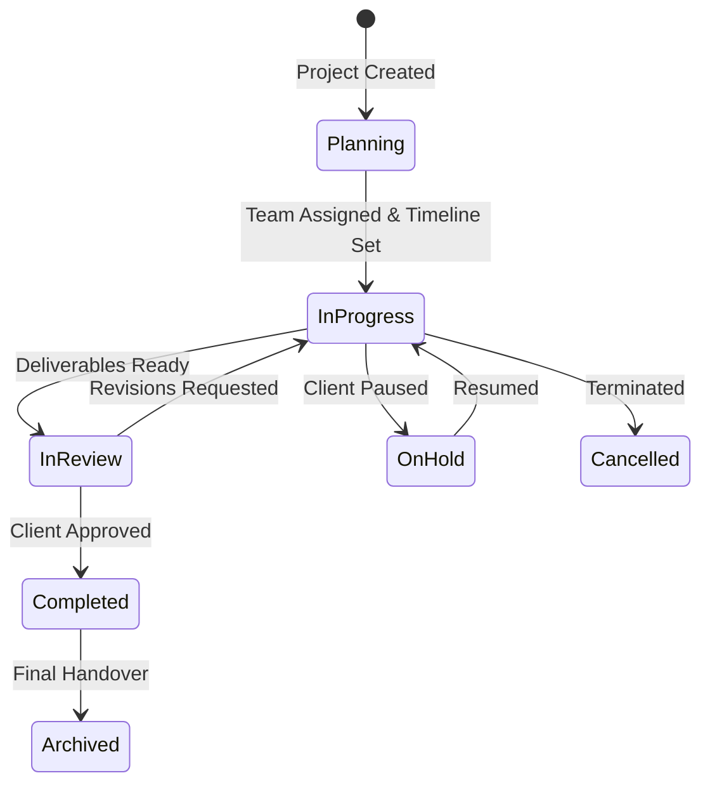
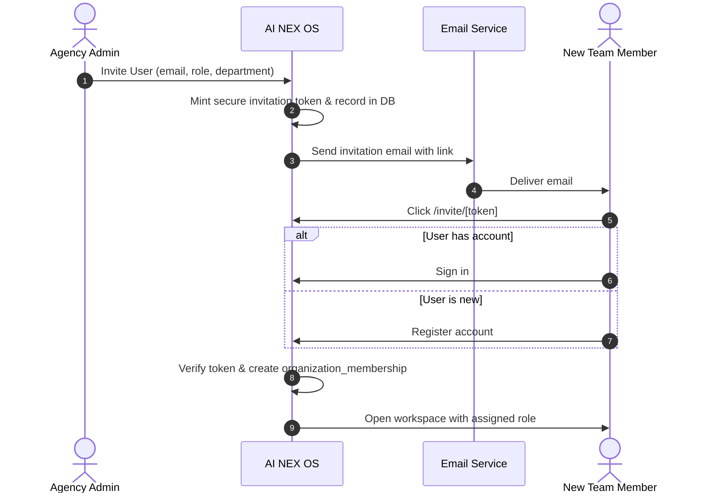

# AI NEX OS — Canonical Product Context Specification (v2.0)
## The Operating System for Creative Execution

**Document Path:** `docs/product/AI-NEX-OS-PRODUCT-CONTEXT-V2.md`  
**Date:** September 25, 2026  
**Document Version:** 2.0 (Agency-Agnostic SaaS Baseline)  
**Product:** AI NEX OS  
**Category:** Agency Operating System (Agency OS)  
**Tagline:** The Operating System for Creative Execution.  
**Auditor / Architect:** Antigravity AI Engineering Assistant  
**Supersedes:** `DOCS/AIC NexOS (PRD).md`, `DOCS/AIC Nex OS (SDS).md`, `DOCS/AIC Nex OS (TRD) .md`, `DOCS/AIC Nex OS (DBD).md`  

---

## Table of Contents
1. [Product Identity](#1-product-identity)
2. [Product Category](#2-product-category)
3. [Product Vision](#3-product-vision)
4. [Product Mission](#4-product-mission)
5. [Product Positioning](#5-product-positioning)
6. [Target Organizations](#6-target-organizations)
7. [Primary Personas](#7-primary-personas)
8. [Core Problems](#8-core-problems)
9. [Product Principles](#9-product-principles)
10. [Workspace Concept](#10-workspace-concept)
11. [Workforce Concept](#11-workforce-concept)
12. [Client Experience](#12-client-experience)
13. [Project Lifecycle](#13-project-lifecycle)
14. [Production Lifecycle](#14-production-lifecycle)
15. [Collaboration Model](#15-collaboration-model)
16. [Approval Model](#16-approval-model)
17. [File and Asset Model](#17-file-and-asset-model)
18. [Communication Model](#18-communication-model)
19. [Workforce Operations](#19-workforce-operations)
20. [AI Capability Layer](#20-ai-capability-layer)
21. [Organization Model](#21-organization-model)
22. [Multi-Tenant Model](#22-multi-tenant-model)
23. [Identity Model](#23-identity-model)
24. [Membership Model](#24-membership-model)
25. [Role Model](#25-role-model)
26. [Permission Model](#26-permission-model)
27. [Invitation Model](#27-invitation-model)
28. [Onboarding Model](#28-onboarding-model)
29. [Client Portal Model](#29-client-portal-model)
30. [Security Principles](#30-security-principles)
31. [Auditability](#31-auditability)
32. [Branding Model](#32-branding-model)
33. [Public Website](#33-public-website)
34. [SaaS Model](#34-saas-model)
35. [Current Implemented Capabilities](#35-current-implemented-capabilities)
36. [Planned Capabilities](#36-planned-capabilities)
37. [Future Capabilities](#37-future-capabilities)
38. [Explicit Non-Goals](#38-explicit-non-goals)
39. [Terminology Dictionary](#39-terminology-dictionary)

---

## 1. Product Identity

- **Official Product Name:** AI NEX OS
- **Tagline:** The Operating System for Creative Execution.
- **Short Name / Monogram:** NEX / NX
- **Repository Baseline:** `ai-nexos` (`NEXOS Comb / AIC NEXOS / ai-nexos`)
- **System Nature:** Enterprise-grade, multi-tenant B2B SaaS platform specifically designed to unify creative project production, client collaboration, media asset management, and creative workforce operations into a cohesive system of record.
- **Independence Statement:** AI NEX OS is an agency-agnostic platform. References to "AI Collective" in legacy documentation represent early design sponsorship and historical seed context, not a hardcoded product boundary.

---

## 2. Product Category

**Category: Agency Operating System (Agency OS)**

AI NEX OS is not a generic project management tool (like Asana, Monday, or ClickUp), nor a generic communications suite (like Slack or Teams), nor an isolated time-clock (like Toggl or Harvest). It is a unified **Agency Operating System** purpose-built for the high-velocity, high-iteration operational realities of modern creative production.

It unifies three traditionally fragmented agency dimensions:
1. **Work Management**: Projects, tasks, milestones, deliverables, timelines, and revisions.
2. **Client Collaboration**: Frictionless, zero-login, tokenized client portals for review and legal approval.
3. **Workforce Operations**: Time-tracking, verified attendance, department structure, and capacity planning.

---

## 3. Product Vision

To become the standard operational backbone for creative agencies, design studios, and production houses worldwide—eliminating tool fragmentation, administrative chaos, and approval friction so creative teams can execute with uncompromising velocity, transparency, and craft.

---

## 4. Product Mission

To replace the fragile web of spreadsheets, disparate messaging apps, detached cloud drives, and email approval threads with a single, intelligent, and secure operating platform that connects every creative artifact to its client, creator, deadline, cost, and sign-off.

---

## 5. Product Positioning

```
┌─────────────────────────────────────────────────────────────┐
│                       AI NEX OS                             │
│         The Operating System for Creative Execution         │
└──────────────────────────────┬──────────────────────────────┘
                               │
       ┌───────────────────────┼───────────────────────┐
       ▼                       ▼                       ▼
┌──────────────┐       ┌──────────────┐       ┌──────────────┐
│  Workspace   │       │ Client Share │       │  Workforce   │
│  Operations  │       │   Portals    │       │  Operations  │
└──────────────┘       └──────────────┘       └──────────────┘
```

- **Not an "AI Agency Tool":** AI is not the customer definition; rather, artificial intelligence is an embedded capability layer that assists human creators, managers, and directors.
- **High-Aesthetic, Dark-Tech Polish:** Clean Swiss typography, subtle borders, high contrast, zero-latency feedback, and professional execution aesthetic.
- **Frictionless Client Boundary:** Agency staff execute within an authenticated workspace, while clients collaborate via secure, branded share links without account creation friction.

---

## 6. Target Organizations

AI NEX OS is designed for businesses whose primary deliverable is creative, visual, strategic, or digital craft:
1. **Creative & Advertising Agencies:** Brand strategy, multi-channel campaigns, copywriting, art direction.
2. **Design & Branding Studios:** Visual identity systems, typography, design systems, UI/UX production.
3. **Video Production & Animation Companies:** Storyboarding, post-production, VFX, video editing pipelines.
4. **Content & Social Media Agencies:** High-volume visual asset creation, creative variants, copywriting.
5. **AI-Native Creative Studios:** Prompt engineering workflows, generative image/video synthesis pipelines, automated variant scaling.
6. **In-House Enterprise Creative Teams:** Corporate marketing and media production departments needing agency-level structure.
7. **Hybrid Creative & Development Consultancies:** Digital design combined with engineering execution.

---

## 7. Primary Personas

### 7.1 Internal Agency Personas
- **Agency Owner / Partner (`owner`):**
  - *Needs:* Macro visibility over agency margin, client satisfaction, operational throughput, and team capacity.
  - *Authority:* Full administrative and destructive authority across the entire organization.
- **Super Administrator (`super_admin`):**
  - *Needs:* User provisioning, department management, billing configuration, security compliance, audit log oversight.
  - *Authority:* Comprehensive operational configuration excluding sole-owner destruction.
- **Creative Director (`creative_director`):**
  - *Needs:* Quality control, aesthetic direction, deliverable approvals, revision triage, and creative assignment.
  - *Authority:* Project, deliverable, and revision governance; full review authority.
- **Project Manager (`project_manager`):**
  - *Needs:* Deadlines, timeline dependencies, task assignment, budget tracking, client communication, meeting minutes.
  - *Authority:* Project, task, timeline, and share link management.
- **Creative Team Member (`team_member`):**
  - *Needs:* Clear task priorities, brief clarity, asset downloads, revision checklists, time recording, and clock-in/out.
  - *Authority:* Read assigned resources; update task progress; upload revisions; log personal time.
- **HR / Operations Manager (`hr`):**
  - *Needs:* Employee directory, attendance compliance, shift correction review, leave/absence tracking.
  - *Authority:* Attendance oversight, correction queue approval, employee record administration.
- **Finance Lead (`finance`):**
  - *Needs:* Billable hour verification, project time logs, invoicing data, and budget utilization.
  - *Authority:* Financial reporting, time audit logs, read access to clients and projects.

### 7.2 External Client Personas
- **Client Executive / Stakeholder:**
  - *Needs:* High-level milestone visibility, deadline tracking, milestone sign-off.
  - *Interaction:* Zero-login web portal via cryptographic share link.
- **Client Creative Reviewer:**
  - *Needs:* Asset inspection, video/image review, timestamped annotations, revision requests.
  - *Interaction:* Interactive review session via share link.

---

## 8. Core Problems

1. **Tool Fragmentation & Data Silos:** Agencies juggle Asana (tasks), Slack (chat), Google Drive (files), Frame.io (reviews), Toggl (time), and DocuSign (approvals), causing context loss and miscommunication.
2. **Client Collaboration Friction:** Forcing external clients to create logins and learn complex project management tools leads to client refusal and unlogged email feedback.
3. **Approval Ambiguity & Revision Hell:** Vague feedback in chat leads to endless unbilled revision cycles without a clear paper trail of sign-offs.
4. **Disjointed Workforce & Attendance Tracking:** Agency management lacks real-time insight into whether billable staff are actively engaged, on break, or over-allocated.
5. **Loss of Asset Version Control:** Teams work on outdated files scattered across local folders and cloud storage without version lineage.

---

## 9. Product Principles

1. **Single Source of Truth:** Every project, deliverable, revision, task, meeting, and punch-clock entry lives in one unified data hierarchy.
2. **Zero Client Friction:** External stakeholders must never be forced to create accounts to review work or approve milestones.
3. **The Tenant Is Never a Parameter:** Multi-tenant security is non-negotiable. Organization boundary is resolved from verified session tokens, never client parameters.
4. **Aesthetic Excellence:** An operating system for creative professionals must look and feel world-class—sharp, responsive, typography-led, and devoid of generic clutter.
5. **Radical Auditability:** Every status change, file upload, approval decision, revision request, and attendance punch leaves an immutable audit record.
6. **Graceful Degradation:** Core operations must function with lightning speed without requiring AI services; AI acts as an accelerator, not a bottleneck.

---

## 10. Workspace Concept

The **Workspace** is the agency's collaborative execution domain where creative craft is planned, executed, refined, and delivered.

```
Workspace
├── Clients (CRM & Company Contacts)
├── Projects (Budgets, Teams, Codes, Status)
│   ├── Timelines & Milestones (Gantt, Phases)
│   ├── Tasks (Assignees, Boards, Dependencies, Time Tracking)
│   ├── Deliverables (Creative Assets, Multi-format Versions)
│   │   ├── Revisions (Itemized Changes, Checklist, Merges)
│   │   └── Review Sessions (Feedback Threads, Annotations)
│   ├── Files (Cloud Asset Repository, Folder Hierarchy)
│   └── Meetings (Agendas, Decisions, Action Items)
└── Calendar (Composed Milestone & Task Schedule)
```

- **Scope:** Workspace operations are shared across creative, design, production, and management staff according to RBAC permissions.
- **Data Boundary:** Strictly isolated by `organization_id`.

---

## 11. Workforce Concept

The **Workforce** is the operational human resources and capacity management domain.

```
Workforce
├── Employees (Directory, Profiles, Designations, Joining Dates)
├── Departments (Creative, Design, Video, Development, Operations)
├── Shift Attendance (Clock-in, Clock-out, Breaks, Real-time Status)
├── Attendance History (Daily Timesheets, Duration Calculation)
├── Corrections System (Punch Correction Requests, Audit Reasons)
├── Review Queue (Manager / HR Verification & Approval)
├── Team Live Board (Real-time active employee oversight)
└── Work Validation Engine (Focus index, break deduction, effective hours)
```

- **Shared Foundation:** Workspace and Workforce are **not** separate systems or logins; they share the same identity, organization, role, and permission infrastructure.

---

## 12. Client Experience

- **The Share Link Paradigm:** Instead of forcing clients to register accounts, AI NEX OS mints cryptographically signed, expiring, revocable share links (`portal.<domain>/s/{token}`).
- **Capabilities on Share Portals:**
  - View project status and upcoming delivery dates.
  - Stream/inspect high-resolution media deliverables.
  - Leave contextual feedback and timestamped annotations.
  - Formally approve deliverables or request itemized revisions.
  - Download approved final production assets.
- **Security Safeguards:** Share links support expiration dates, password protection, domain-restricted referrers, and immediate one-click revocation.

---

## 13. Project Lifecycle



1. **Initiation (`planning`):** Client linked, project manager assigned, budget set, dynamic project code minted (`{ORG}-YYYY-XXXX`).
2. **Active Execution (`in_progress`):** Tasks scheduled, assignees executing, time logged, meetings documented.
3. **Review & Approval (`in_review`):** Deliverables submitted to internal leads or external client share portals.
4. **Revision Loops:** Detailed itemized feedback processed, parent/child deliverable lineage maintained.
5. **Completion (`completed`):** Formal sign-off recorded, deliverables delivered.
6. **Archival (`archived`):** Soft-deleted from active views, preserved for billing and historical reference.

---

## 14. Production Lifecycle

Deliverables move through a strict, multi-stage production pipeline:

```
Brief / Task
     ↓
Draft Creation
     ↓
Internal Review (Creative Director / PM)
     ↓
Client Review (Share Portal)
     ├── Revision Requested → Itemized Revision Ticket → Draft Update
     └── Approved → Final Asset Generation → Archival / Distribution
```

- **Deliverable Formats:** Video (MP4, ProRes, MOV), Still (PNG, JPG, SVG, PSD), Document (PDF, Copy deck), Interactive/Code.
- **Version Lineage:** Every revision retains a permanent link to its previous version, ensuring full historical comparability.

---

## 15. Collaboration Model

- **Real-Time Context:** Comments, decisions, and activity logs attach directly to the artifact (Task, Deliverable, Revision, Meeting).
- **Internal vs. External Threads:** Comments are explicitly partitioned:
  - `internal`: Visible only to authenticated workspace members.
  - `client`: Shared with external reviewers through the portal.
- **Mention Notifications:** In-app and email alerts triggered when team members are tagged or assigned.

---

## 16. Approval Model

- **Formal Decision Records:** Approvals are not simple emoji reactions; they represent auditable events recording:
  - Approver Identity (User ID for internal; Name, Email, IP, User-Agent for external clients).
  - Decision Status (`approved`, `rejected`, `revision_requested`).
  - Timestamp & Version Stamp (`version` incremented).
  - Optional signature note or client acknowledgement.
- **Delegated Authority:** Project Managers and Creative Directors can delegate review authority to specific team members or external client contacts.

---

## 17. File and Asset Model

- **Hierarchy:** Organization → Folders → Files → File Versions.
- **Storage Architecture:**
  - Backed by Supabase Storage (`NEXT_PUBLIC_SUPABASE_STORAGE_BUCKET`).
  - Direct secure uploads using signed URLs.
  - Content hashing (`sha256`) to prevent duplicate storage.
  - Metadata indexing: MIME type, byte size, resolution, color space, duration.
- **Access Control:** Storage buckets enforce organization prefix isolation (`/{organization_id}/*`).

---

## 18. Communication Model

- **Context-Bound Communication:** Discussions are attached to specific deliverables, tasks, or meeting agendas rather than isolated in sprawling, disconnected chat channels.
- **Meeting Hub:**
  - Agenda creation with assigned owners and durations.
  - Real-time decision logs linked to dependent projects.
  - Action items with one-click conversion to tasks with auto-generated task codes.
  - Meeting recordings and AI transcript attachments.

---

## 19. Workforce Operations

- **Shift Punch Clock:**
  - `clock_in`: Initiates shift, records local timestamp and organization business day.
  - `break_start` / `break_end`: Tracks lunch and rest breaks (paid vs unpaid).
  - `clock_out`: Concludes shift, triggers automated work duration calculation.
- **Timezone Discipline:** All workforce records are computed in the organization's canonical timezone (`organizations.timezone`), preventing cross-timezone date misalignment for distributed teams.
- **Attendance Corrections:**
  - Staff submit correction requests for missed punches with an audit explanation.
  - Supervisors/HR approve or reject corrections from the Review Queue (`/workforce/corrections/review`).

---

## 20. AI Capability Layer

AI is integrated as an assistive operational capability across the platform:

```
Platform Core
     ├── AI Meeting Summarizer (Converts transcripts to decisions & action items)
     ├── AI Revision Parser (Extracts itemized tasks from client feedback)
     ├── AI Task Assistant (Suggests task breakdowns from project briefs)
     ├── AI Copy & Variant Generator (Drafts creative copy variations)
     ├── AI Project Risk Analyzer (Flags schedule slips and dependency blocks)
     └── AI Governance & Token Budgeting (Tracks costs per organization)
```

- **Non-Dependency Guarantee:** The platform remains 100% operational if AI providers experience outages.
- **Cost Governance:** `ai_cost_tracking` logs token consumption by model, feature, and organization, enabling tier-based AI billing limits.

---

## 21. Organization Model

The **Organization** (`public.organizations`) represents a legal, commercial tenant:
- **Core Attributes:** Name, Legal Name, URL Slug (unique), Timezone, Currency, Country, Address.
- **Branding Attributes:** `brand_primary_color`, `brand_secondary_color`, `logo_url`, `favicon_url`.
- **System Config:** `code_prefix` (e.g., `NEX`, `ACME` - governing project/task/employee code formats).
- **Sequences:** `organization_sequences` maintains monotonic counters per entity type (`project_code`, `task_code`, `employee_code`).

---

## 22. Multi-Tenant Model

```
                               ┌─────────────────┐
                               │   Platform DB   │
                               └────────┬────────┘
                                        │
           ┌────────────────────────────┴────────────────────────────┐
           ▼                                                         ▼
┌─────────────────────────┐                               ┌─────────────────────────┐
│     Organization A      │                               │     Organization B      │
│  (e.g., Nexus Studio)   │                               │  (e.g., Apex Creative)  │
├─────────────────────────┤                               ├─────────────────────────┤
│ • Projects: NEX-2026-01 │                               │ • Projects: APX-2026-01 │
│ • Members: 12           │                               │ • Members: 35           │
│ • Custom Brand: Indigo  │                               │ • Custom Brand: Emerald │
└─────────────────────────┘                               └─────────────────────────┘
```

- **Logical Isolation:** Shared database infrastructure with strict logical isolation enforced on every operational table via `organization_id`.
- **Defense in Depth:**
  - *Layer 1 (PostgreSQL RLS):* `app.is_org_member(organization_id)` restricts data access at the database engine level for Supabase client queries.
  - *Layer 2 (Application Scoping):* All Drizzle ORM queries explicitly predicate on `eq(table.organizationId, user.organizationId)`.
  - *Layer 3 (Static Safety Gate):* Automated AST test `tenant-identity-surface.test.ts` rejects any server action accepting caller-supplied tenant arguments.

---

## 23. Identity Model

- **Global Authentication Identity (`auth.users`):** Managed securely by Supabase Auth (UUID, email, password hash, OAuth provider tokens).
- **User Profile (`public.users`):** Stores personal profile information (first name, last name, avatar, timezone, phone).
- **Decoupled Identity Target:** In the SaaS target architecture, `public.users` represents the individual creator's global identity, while their agency affiliations are managed via memberships.

---

## 24. Membership Model

The **Membership Model** (`organization_memberships`) establishes the multi-workspace relationship:

```
[User Identity] 1 ──── N [Organization Membership] N ──── 1 [Organization]
                                    │
                                    ├── role_id (e.g., Project Manager in Org A)
                                    ├── department_id
                                    ├── status ('active', 'invited', 'suspended')
                                    └── is_default
```

- **Multi-Agency Access:** A freelancer or contractor can belong to "Agency A" as a *Team Member* and "Agency B" as a *Creative Director* using a single login.
- **Active Workspace Context:** Current organization is maintained in the authenticated session state; users switch organizations using a header dropdown without re-authenticating.

---

## 25. Role Model

Seven canonical system roles are seeded per organization:
1. **Owner (`owner`):** Unrestricted platform governance and administrative control.
2. **Super Admin (`super_admin`):** General management across all departments and settings.
3. **HR (`hr`):** Employee directory, attendance oversight, and shift correction approvals.
4. **Creative Director (`creative_director`):** Creative quality assurance, deliverable sign-offs, and project oversight.
5. **Project Manager (`project_manager`):** Project planning, timelines, client relations, and task delivery.
6. **Team Member (`team_member`):** Creative production execution, task tracking, and time logging.
7. **Finance (`finance`):** Financial reports, invoicing verification, and budget auditing.
8. **Custom Roles [PLANNED]:** Ability for agencies to define bespoke roles with granular permissions.

---

## 26. Permission Model

- **Matrix:** 22 Modules × 15 Actions.
- **Wildcard Syntax:** `{"*": ["*"]}` grants total access; `{"projects": ["*"]}` grants all project actions; `{"deliverables": ["read", "review"]}` grants specific actions.
- **Dual Evaluation Parity:**
  - *TypeScript:* `hasPermission(permissions, module, action)` in `@/features/permissions/engine`.
  - *PostgreSQL:* `app.has_permission(p_module text, p_action text)` in database functions.

---

## 27. Invitation Model



---

## 28. Onboarding Model

The platform accommodates three distinct initial states for authenticated users:

### State A: Member of One or More Workspaces
```
Authenticate
     ↓
Resolve Memberships
     ↓
Single Membership? ── Yes ──► Enter Workspace
     │
     └── No (Multiple) ─────► Select Workspace ──► Enter Workspace
```

### State B: Authenticated User with No Workspace
```
Authenticate
     ↓
No Memberships Found
     ↓
Onboarding Choice Screen
     ├── [Create New Agency Workspace] ──► Provision Org, Seed Roles, Assign Owner ──► Enter Dashboard
     └── [Join Existing Agency] ─────────► Enter Invitation Code / Contact Admin
```

### State C: User with Pending Invitation
```
Authenticate via Invitation Link
     ↓
Invitation Token Validated
     ↓
Review Invitation Details (Agency Name, Role, Invited Email)
     ↓
Accept Invitation ──► Membership Created ──► Role Assigned ──► Enter Workspace
```

> **Security Rule:** Owner permissions are **never** automatically granted simply because an email or Google account authenticated. Ownership is established only through explicit workspace creation or formal owner transfer.

---

## 29. Client Portal Model

- **Subdomain / Path Routing:** Accessible on `portal.<domain>` or via `/s/{token}` paths.
- **Stateless Authorization:** Token signature, expiration, and revoked nonces are validated by `@/lib/portal/services/PortalServiceLayer.ts`.
- **Zero Exposure:** External portal traffic is strictly segregated from internal API endpoints and cannot reach internal data tables.

---

## 30. Security Principles

1. **The Four Authorization Controls:** Every request must satisfy (1) Authentication, (2) RBAC Authorization, (3) Object-Level Authorization, and (4) Tenant Isolation (`docs/AUTHORIZATION-CONTROLS.md`).
2. **The Tenant Is Never a Parameter:** `organizationId` is always extracted from the verified session, never from client-provided arguments.
3. **Strict Content Security Policy:** Dynamic per-request nonces in Next.js 16 Edge proxy; `'unsafe-inline'` scripts forbidden.
4. **Fail-Closed Configuration:** Missing production secrets trigger immediate startup abortion via `assertProductionConfig()`.
5. **Anti-Enumeration Rate Limiting:** Auth endpoints enforce independent per-IP and per-account rate limits to prevent credential stuffing.

---

## 31. Auditability

Every critical operation creates an immutable entry in `activity_logs`:
- **Captured Attributes:** `organization_id`, `user_id`, `module`, `action`, `entity_type`, `entity_id`, `description`, `metadata` (JSONB diff), `created_at`.
- **Protected Logs:** `activity_logs` is append-only in PostgreSQL RLS; `UPDATE` and `DELETE` policies are deliberately absent.

---

## 32. Branding Model

- **Default System Aesthetic:** Professional high-tech dark/light mode palette (OKLCH neutral gray scale with precise contrast tokens).
- **Agency White-Labeling:**
  - Organization primary and secondary colors dynamically applied to CSS custom properties.
  - Custom agency logo uploaded to storage and displayed in the sidebar header.
  - Client share portals reflect agency branding to maintain brand credibility with external clients.

---

## 33. Public Website

- **Root Route (`/`):** Dedicated high-converting SaaS landing page replacing the legacy `/dashboard` redirect.
- **Marketing Structure:**
  - Hero: Positioning statement, CTA buttons ("Start Free Trial", "Book Demo").
  - Value Pillars: Production Velocity, Client Transparency, Workforce Integrity.
  - Interactive Feature Bento: Real-time interactive previews of Timelines, Review Portals, and Workforce Clock.
  - Social Proof & Agency Case Studies.
  - Transparent SaaS Pricing Grid.
- **SEO & Social Presence:** Fully configured `robots.ts`, `sitemap.ts`, Open Graph images, and Twitter card metadata.

---

## 34. SaaS Model

- **Multi-Tenant Deployment:** Single scalable cloud infrastructure serving multiple isolated agency tenants.
- **Subscription Tiers [PLANNED]:**
  - **Starter:** Up to 10 members, core workspace modules, basic share portals.
  - **Pro / Agency:** Up to 50 members, workforce operations, unlimited client share portals, custom code prefixes.
  - **Enterprise:** Unlimited members, dedicated SLA, custom domains, SAML SSO, priority AI compute allocation.

---

## 35. Current Implemented Capabilities

The following capabilities are fully verified and operational in code:

| Module / Capability | Status | Implementation Reference |
| :--- | :--- | :--- |
| **Authentication (Password, Magic Link, Google OAuth)** | `[IMPLEMENTED]` | `src/features/auth/real-actions.ts` |
| **Edge Proxy & Session Refresh (Next.js 16)** | `[IMPLEMENTED]` | `src/proxy.ts` |
| **Dual-Domain Routing (App vs. Client Portal)** | `[IMPLEMENTED]` | `src/proxy.ts` |
| **Organizations CRUD & Sequence Generator** | `[IMPLEMENTED]` | `src/features/organizations/real-actions.ts` |
| **Project Management (CRUD, Members, Codes)** | `[IMPLEMENTED]` | `src/features/projects/real-actions.ts` |
| **Client CRM (Companies, Contacts, Projects)** | `[IMPLEMENTED]` | `src/features/clients/real-actions.ts` |
| **Task Management (Kanban, Assignees, Timers)** | `[IMPLEMENTED]` | `src/features/tasks/real-actions.ts` |
| **Timelines & Milestones (Visual Gantt, Phases)** | `[IMPLEMENTED]` | `src/features/timelines/real-actions.ts` |
| **Deliverables & Version Revisions** | `[IMPLEMENTED]` | `src/features/deliverables/real-actions.ts` |
| **File Asset Manager (Buckets, Folders, Versions)** | `[IMPLEMENTED]` | `src/features/files/real-actions.ts` |
| **Meetings Hub (Agenda, Decisions, Action Items)** | `[IMPLEMENTED]` | `src/features/meetings/real-actions.ts` |
| **Workforce Attendance (Clock-In, Breaks, Clock-Out)** | `[IMPLEMENTED]` | `src/features/workforce/attendance/real-repository.ts` |
| **Attendance Punch Corrections & Review Queue** | `[IMPLEMENTED]` | `src/features/workforce/corrections/real-repository.ts` |
| **Team Live Attendance Board** | `[IMPLEMENTED]` | `src/features/workforce/attendance/` |
| **Work Validation Calculation Engines** | `[IMPLEMENTED]` | `src/features/workforce/work-validation/` |
| **RBAC Engine (7 Roles, 22 Modules, 15 Actions)** | `[IMPLEMENTED]` | `src/features/permissions/engine.ts` |
| **PostgreSQL RLS Multi-Tenant Policies** | `[IMPLEMENTED]` | `database/migrations/0001_security_rls_foundation.sql` |
| **Immutable Activity Logging** | `[IMPLEMENTED]` | `src/features/organizations/real-actions.ts` |
| **In-App Notification Dispatcher** | `[IMPLEMENTED]` | `src/features/notifications/real-actions.ts` |

---

## 36. Planned Capabilities

The following capabilities are designed and scheduled for upcoming development phases:

| Capability | Status | Target Phase |
| :--- | :--- | :--- |
| **Agency SaaS Marketing Landing Page (`/`)** | `[PLANNED]` | Phase 2 |
| **Public SEO Infrastructure (`robots.ts`, `sitemap.ts`, OG Cards)** | `[PLANNED]` | Phase 2 |
| **Dynamic Organization Code Prefixes (`code_prefix`)** | `[PLANNED]` | Phase 3 |
| **White-Label Theme CSS Variable Injection** | `[PLANNED]` | Phase 3 |
| **Additive Multi-Tenant Memberships (`organization_memberships`)** | `[PLANNED]` | Phase 4 |
| **Header Organization Switcher Dropdown** | `[PLANNED]` | Phase 4 |
| **Self-Service Agency Onboarding & Signup Flow (`/signup`)** | `[PLANNED]` | Phase 5 |
| **Team Member Email Invitations (`/invite/[token]`)** | `[PLANNED]` | Phase 5 |
| **Password Reset UI Flow (`/forgot-password`)** | `[PLANNED]` | Phase 5 |
| **Workforce Capacity & Utilization Reports** | `[PLANNED]` | Phase 6 |

---

## 37. Future Capabilities

The following features represent the long-term product roadmap:

| Capability | Status | Description |
| :--- | :--- | :--- |
| **Custom Agency Subdomains** | `[FUTURE]` | Allowing agencies to serve workspaces on `acme.ai-nexos.com` or custom CNAME domains. |
| **Client Portal Authenticated Accounts** | `[FUTURE]` | Optional persistent client accounts for high-volume enterprise clients. |
| **AI Meeting Voice-to-Action Pipeline** | `[FUTURE]` | Native streaming transcription with real-time task extraction. |
| **Automated Invoicing & Stripe Integration** | `[FUTURE]` | Generating client invoices directly from approved deliverables and time logs. |
| **Figma & Adobe Creative Cloud Plugins** | `[FUTURE]` | Ingesting revisions directly from creative desktop software. |
| **Enterprise SAML / Okta SSO** | `[FUTURE]` | Enterprise Single Sign-On for large multinational agency networks. |

---

## 38. Explicit Non-Goals

To maintain product discipline and engineering velocity, AI NEX OS will **NOT**:
1. **Compete with Deep Creative Tools:** AI NEX OS is not a digital audio workstation (DAW), 3D renderer, or video editor. It manages the metadata, versions, and approvals of assets produced in external software.
2. **Be an "AI-Only" Agency Tool:** The product will not force generative AI into workflows where traditional creative craft is preferred.
3. **Build Generic Social Media Schedulers:** AI NEX OS is an operating system for production and approvals, not a consumer social media publishing buffer.
4. **Support Unauthenticated Internal Access:** Agency workspace tools strictly require authentication; only external client share links are accessible without login.

---

## 39. Terminology Dictionary

Refer to the companion document **[`docs/product/AI-NEX-OS-TERMINOLOGY.md`](file:///Users/subhamsaha/Downloads/My%20Docs%20/WebsiteCreation/NEXOS%20Comb%20/AIC%20NEXOS/ai-nexos/docs/product/AI-NEX-OS-TERMINOLOGY.md)** for the complete terminology mapping table.

Key canonical anchors:
- **Product:** AI NEX OS
- **Category:** Agency Operating System
- **Tagline:** The Operating System for Creative Execution.
- **Tenant Entity:** Organization
- **User Environment:** Agency Workspace
- **People Operations:** Workforce
- **External Client Surface:** Client Share Portal
- **Security Boundary:** The Tenant Is Never a Parameter
